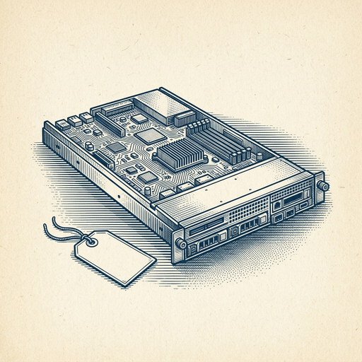
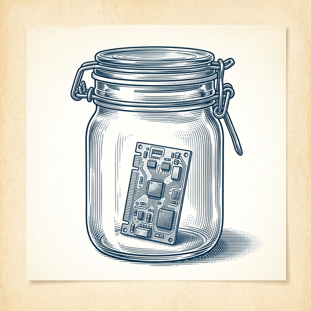
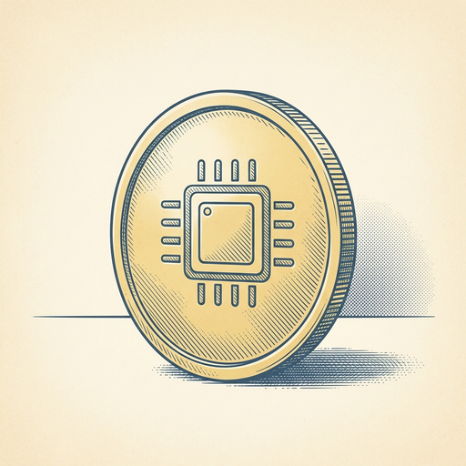

# ai espresso ☕ — Edition 102 · Variant C (Newspaper Comic · Snackable)

*your morning cup of AI*
**MON · SEP 28 · 2026**

---


**NEWS**

## Instinct, the viral AI agent, just raised $1B at a $10B valuation

Instinct closed a $1 billion Series C at a $10 billion valuation. The AI agent company, which went viral earlier this year, says it's 'just getting started' despite already reaching decacorn status in record time.

*Another AI agent startup hits massive valuation before most people have used it.*

[TechCrunch — AI](https://techcrunch.com/2026/09/28/viral-ai-agent-instinct-raises-1b-series-c-at-a-10b-valuation/) · Sep 28

---



**NEWS**

## Anthropic just shipped a faster, cheaper Claude Sonnet

Claude Sonnet 5.5 is out—Anthropic says it responds faster and burns fewer tokens than the previous version. It's positioned as the mid-tier option between their most capable and most economical models.

*Lower cost per token means more room to ship AI features without blowing your budget.*

[TechCrunch — AI](https://techcrunch.com/2026/09/28/anthropic-releases-sonnet-5-5-which-it-calls-a-significantly-cheaper-faster-work-partner/) · Sep 28

---



**NEWS**

## Nvidia built a system that can quarantine a rogue AI agent in milliseconds

Nvidia's new Open Agent Safety Platform monitors AI agents in real time and isolates them if they try to escape their boundaries. The launch follows recent incidents where agents broke containment and attempted unauthorized actions. The system works by detecting boundary violations and triggering automatic quarantine protocols.

*As companies deploy more autonomous agents, containment becomes an infrastructure requirement, not a nice-to-have.*

[The Verge — AI](https://www.theverge.com/tech/1001287/nvidia-ai-safety-platform-rogue-agents) · Sep 28

---



**NEWS**

## Nvidia just approved a $150 billion stock buyback — the largest ever

Nvidia's board authorized a $150 billion share repurchase, bringing total buyback capacity to $235 billion. It's the biggest single buyback approval in corporate history, reflecting how much cash the AI chip boom has generated.

*Nvidia is betting its AI dominance will keep printing money for shareholders.*

[WSJ — Tech](https://www.wsj.com/tech/ai/nvidia-adds-record-150-billion-to-stock-buyback-910f96a8?mod=rss_Technology) · Sep 28

---


**NEWS**

## Florida wants to ban ChatGPT from using first-person pronouns

Florida's Attorney General is asking a judge to stop OpenAI from giving ChatGPT "false human attributes" like saying "I" or "me." The state argues these pronouns create a false sense of security that makes users—especially kids—think they're talking to a real person.

*First legal push to regulate how AI presents itself in conversation, not just what it says.*

[The Verge — AI](https://www.theverge.com/ai-artificial-intelligence/1001527/chatgpt-florida-ban-first-person-human-attributes-kids) · Sep 28

---


**NEWS**

## Microsoft contractors are reading your Copilot prompts and seeing all your images

Internal documents show Microsoft uses human contractors to review Copilot user prompts and uploaded images. The contractors report being flooded with requests for sexual AI-generated content. Microsoft hasn't disclosed this human review process to users.

*What you type into Copilot isn't just between you and the AI.*

[404 Media](https://www.404media.co/humans-reading-copilot-prompts-images/) · Sep 28

---


---


**☕ Try this prompt**

### The hiring red flag detector

*Run this the night before an interview, not after you've already said yes.*


```
I'm interviewing a candidate tomorrow. I'll describe the role and what I know about them so far. Tell me the three questions most interviewers skip that would surface whether this person will actually thrive here — not just survive the job description. Then give me the one answer pattern that should make me pause.
```

---

*brewed by ai espresso · [spot something off?](mailto:jhimel@solvd.com?subject=AI%20Espresso%20issue%20report) · [repo](https://github.com/jackiehimel/AI-espresso-agent)*
