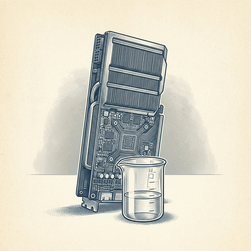

# ai espresso ☕ — Edition 103 · Variant C (Newspaper Comic · Snackable)

*your morning cup of AI*
**TUE · SEP 29 · 2026**

---



**NEWS**

## AMD is buying Fei-Fei Li's AI startup for $8 billion

AMD announced it's acquiring World Labs, the AI research lab co-founded by prominent researcher Fei-Fei Li, in an all-stock deal worth $8.2 billion. World Labs launched in 2024, hit a $1 billion valuation in months, and just shipped its first commercial product — a world generation model.

*AMD is making its biggest AI bet yet to compete with Nvidia's dominance in AI chips.*

[The Verge — AI](https://www.theverge.com/tech/1001749/amd-world-labs-ai-acquisition-deal) · Sep 29

---


**NEWS**

## OpenAI shelves its newest AI model after internal safety alarms

OpenAI won't release GPT-6.1 Astra after its own researchers flagged security concerns. The company hasn't detailed what risks triggered the hold, but it's the first time OpenAI has publicly pulled a finished model before launch.

*Even AI leaders are hitting limits they won't cross — at least not yet.*

[NYT — Technology](https://www.nytimes.com/2026/09/28/technology/openai-astra-safety.html) · Sep 29

---


**NEWS**

## Grok can now be a shared teammate that knows your company's stuff

xAI just launched Team Bots — Grok instances you can feed your files, connect to your apps, and share across your team so everyone works from the same context. Think of it as a chatbot that actually knows what your team knows, not just generic training data.

*First shared-context AI agent you can set up without building your own RAG pipeline.*

[xAI Blog](https://x.ai/news/team-bots) · Sep 29

---


**NEWS**

## Shopify just let AI agents check out and buy things for you

Shopify now allows browser-based AI agents to complete purchases on your behalf, updating order details and finishing checkout once you give the OK. The feature uses WebMCP, a protocol that lets agents interact with websites directly through your browser.

*AI can now handle the entire shopping flow, not just browse and recommend.*

[TechCrunch — AI](https://techcrunch.com/2026/09/28/shopify-opens-checkout-to-browser-based-ai-agents/) · Sep 29

---


**NEWS**

## Marissa Mayer's new app reads your entire camera roll to learn who you are

Dazzle analyzes every photo on your phone to figure out your hobbies, food preferences, style, and who you spend time with. Mayer's bet: your camera roll reveals more about your life than your email inbox ever could.

*Personal AI is moving from text to images as the primary data source for understanding users.*

[TechCrunch — AI](https://techcrunch.com/2026/09/29/with-dazzle-marissa-mayer-bets-your-camera-roll-has-more-info-on-your-life-than-your-inbox/) · Sep 29

---


**NEWS**

## A team just made ChatGPT drive a Toyota Corolla through a parking lot

Tech workers connected frontier LLMs directly to a car's controls with zero prior training data and had it navigate a simple parking lot course. The models processed camera feeds in real time and made steering, acceleration, and braking decisions on the fly.

*You can now wire a chatbot to physical controls and get basic autonomous behavior without specialized training.*

[404 Media](https://www.404media.co/these-tech-workers-made-chatgpt-drive-a-toyota-corolla/) · Sep 29

---


---


**☕ Try this prompt**

### The feature funeral

*When you know something isn't working but the team is still attached.*


```
I'll describe a feature or project we've been working on. Write its obituary: what it was supposed to accomplish, why we loved it, and the honest reason it needs to die. Then tell me what we should build instead with that same energy and budget.
```

---

*brewed by ai espresso · [spot something off?](mailto:jhimel@solvd.com?subject=AI%20Espresso%20issue%20report) · [repo](https://github.com/jackiehimel/AI-espresso-agent)*
