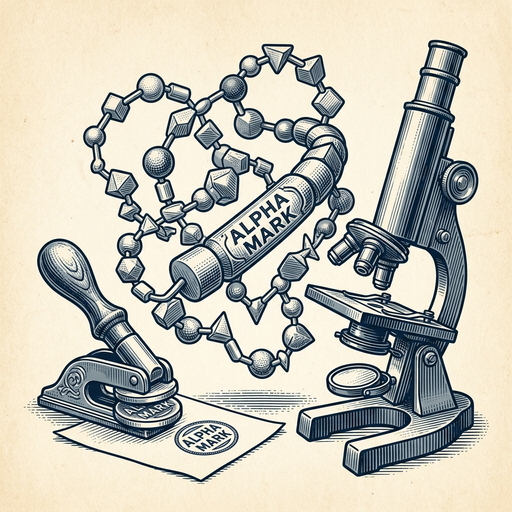

# ai espresso ☕ — Edition 104 · Variant C (Newspaper Comic · Snackable)

*your morning cup of AI*
**WED · SEP 30 · 2026**

---


**NEWS**

## FTC opens investigation into OpenAI and Anthropic over consumer harm

The Federal Trade Commission is examining whether the two leading AI labs violated laws against unfair and deceptive business practices. The probe marks the agency's most direct regulatory action against frontier AI companies to date.

*Major AI labs now face federal scrutiny that could reshape how they deploy models and communicate capabilities.*

[NYT — Technology](https://www.nytimes.com/2026/09/30/technology/ftc-openai-anthropic-investigation.html) · Sep 30

---


**NEWS**

## DoorDash just launched an AI agent you can text to order food

DoorDash now lets you text an AI agent to place orders instead of using the app. The company is betting conversational ordering will help it compete with Uber Eats and Grubhub, especially for people who find apps too clunky or slow.

*Ordering food by text could become faster than tapping through menus in an app.*

[TechCrunch — AI](https://techcrunch.com/2026/09/30/doordash-launches-an-ai-agent-you-can-text-to-order-food/) · Sep 30

---


**NEWS**

## Google is now paying publishers to show up in AI search results

Google launched a pilot with roughly 100 publishers who get paid when their content appears in AI-generated search answers. The move comes as publishers worry AI overviews are killing their traffic by answering questions directly instead of sending clicks to their sites.

*First major search engine to share revenue with the sources its AI is summarizing.*

[The Verge — AI](https://www.theverge.com/tech/1002665/google-paying-publishers-ai-search-features) · Sep 30

---



**NEWS**

## DeepMind can now watermark AI-generated proteins without breaking them

Google's SynthID Bio embeds invisible watermarks into protein sequences that AI generates. The watermark survives in the actual folded protein and doesn't affect how it works biologically. Researchers can detect whether a protein came from a model, even after it's been synthesized in a lab.

*You can now track AI-designed proteins in the wild without compromising their function.*

[Google DeepMind Blog](https://deepmind.google/blog/introducing-synthid-bio/) · Sep 30

---


---


**☕ Try this prompt**

### The meeting escape hatch

*Before you spend an hour in a room that could've been three replies.*


```
I have a meeting on my calendar. Tell me three questions I can send in advance that — if answered clearly — would make the meeting unnecessary. Then tell me the one-line message to propose skipping it that doesn't sound passive-aggressive.
```

---

*brewed by ai espresso · [spot something off?](mailto:jhimel@solvd.com?subject=AI%20Espresso%20issue%20report) · [repo](https://github.com/jackiehimel/AI-espresso-agent)*
