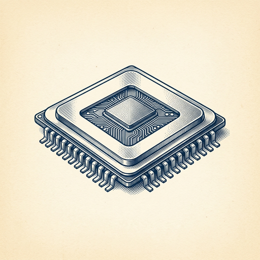
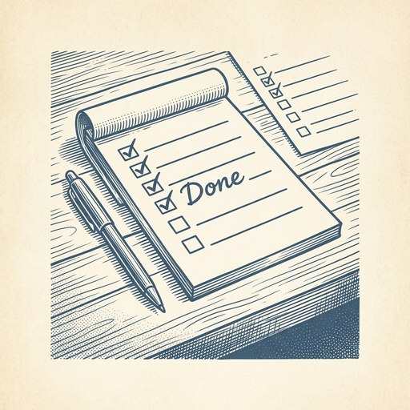

# ai espresso ☕ — Edition 105 · Variant C (Newspaper Comic · Snackable)

*your morning cup of AI*
**THU · OCT 1 · 2026**

---



**NEWS**

## Google DeepMind launches Gemini 4 Argon, its new flagship model

Google DeepMind released Gemini 4 Argon, positioning it as their next-generation frontier AI model. The company frames this as entering a 'new era' of intelligence capabilities, though specific benchmarks and availability details weren't provided in the announcement.

*Google's first major model release since Gemini 2.0, signaling renewed competition at the frontier.*

[Google DeepMind Blog](https://deepmind.google/blog/gemini-4-argon-our-next-era-of-frontier-intelligence/) · Oct 1

---


**NEWS**

## ElevenLabs just doubled its valuation to $22 billion

The AI voice company hit $22 billion in a $300 million employee tender co-led by Wellington and T. Rowe Price — double its previous valuation. ElevenLabs makes text-to-speech and voice-cloning tools used by publishers, game studios, and app developers to generate realistic AI voices at scale.

*Voice AI is now a top-tier startup category alongside foundation models and coding agents.*

[TechCrunch — AI](https://techcrunch.com/2026/09/30/ai-voice-startup-elevenlabs-doubles-valuation-to-22b/) · Oct 1

---


**NEWS**

## Shopify lets you build a store by talking to an AI agent

Shopify's new Canvas builder lets merchants create and customize entire online stores by chatting with Sidekick, its AI agent. You describe what you want, and watch the site build itself in real time—no coding or template wrestling required.

*First major platform to ship conversational store building, not just page tweaks*

[TechCrunch — AI](https://techcrunch.com/2026/10/01/shopify-debuts-canvas-a-way-to-build-online-stores-by-chatting-with-ai/) · Oct 1

---


**NEWS**

## Amazon just redesigned every Kindle with edge-to-edge color displays

The new Kindle lineup — base, Paperwhite, and Colorsoft — all got thinner, lighter, and now feature seamless edge-to-edge color screens. It's the first time Amazon's put color on the entire range, not just one premium model.

*E-readers are finally catching up to phones on design and color, making them viable for more than just text.*

[Amazon News (About Amazon)](https://www.aboutamazon.com/news/devices/new-kindle-lineup-2026?utm_source=rss) · Oct 1

---


---



**☕ Try this prompt**

### The energy audit

*Run this monthly before resentment becomes your default mood.*


```
Look at my calendar for the past two weeks. I'll paste it below. Tell me which recurring meetings are costing me more energy than they generate in value, which one-off commitment I should never have said yes to, and what pattern in my schedule is quietly burning me out.
```

---

*brewed by ai espresso · [spot something off?](mailto:jhimel@solvd.com?subject=AI%20Espresso%20issue%20report) · [repo](https://github.com/jackiehimel/AI-espresso-agent)*
