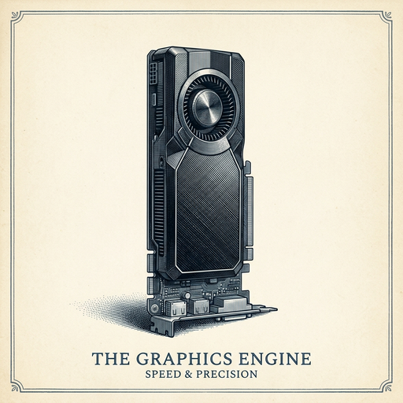

# ai espresso ☕ — Edition 106 · Variant C (Newspaper Comic · Snackable)

*your morning cup of AI*
**FRI · OCT 2 · 2026**

---


**NEWS**

## ChatGPT can now virtually try on clothes using your photo

OpenAI added shopping features to ChatGPT that let you upload a photo of yourself and see how clothes and accessories would look on you. You can also save items you like to a Favorites library for later.

*AI moved from answering questions to showing you what you'd look like in that jacket.*

[TechCrunch — AI](https://techcrunch.com/2026/10/01/chatgpt-can-now-virtually-try-on-clothes-for-you/) · Oct 2

---


**NEWS**

## Google's Gemini Live can now narrate whatever your phone camera sees

A new Guided Vision feature in Gemini Live gives real-time audio descriptions of anything you point your Android camera at. You can ask it to read fine print, describe your surroundings, or help you find objects around you — all through live voice interaction while the camera stays open.

*Turns your phone into a seeing-eye AI that talks you through the physical world in real time.*

[The Verge — AI](https://www.theverge.com/ai-artificial-intelligence/1003756/google-gemini-live-guided-vision) · Oct 2

---


**NEWS**

## Suno's AI music generator now does voiceovers with background music

Suno launched a feature that generates spoken voices from scripts or prompts, with background music to match. The new Speech tool is live in public beta on web and mobile, letting you create voiceovers and soundtracks together in one go.

*AI audio tools are merging — one prompt now gets you narration plus soundtrack.*

[The Verge — AI](https://www.theverge.com/ai-artificial-intelligence/1003925/suno-speech-ai-voice-feature-beta-availability) · Oct 2

---



**NEWS**

## OpenAI's GPT-6 Astra Ultrafast runs 8x faster on NVIDIA Blackwell GPUs

GPT-6 Astra Ultrafast is now live in the OpenAI API and for select ChatGPT Work and Codex users, generating tokens up to 8x faster than Astra Standard mode by using inference optimizations built for NVIDIA's Blackwell architecture.

*Faster inference means lower latency for production apps and cheaper costs at scale.*

[NVIDIA Blog](https://blogs.nvidia.com/blog/gpus-openai-gpt-6-astra-ultrafast/) · Oct 2

---


---


**☕ Try this prompt**

### The learning receipt

*Turns passive consumption into active retention before the details evaporate.*


```
I just finished a book, course, or deep research dive. Before I forget everything, help me create a one-page document with: the three ideas I'll actually use, the one mental model that changed how I see something, and the specific situation where I'll apply this next week.
```

---

*brewed by ai espresso · [spot something off?](mailto:jhimel@solvd.com?subject=AI%20Espresso%20issue%20report) · [repo](https://github.com/jackiehimel/AI-espresso-agent)*
