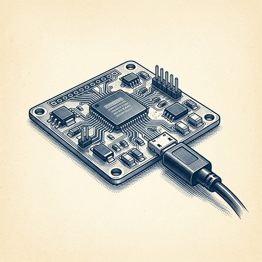

# ai espresso ☕ — Edition 108 · Variant C (Newspaper Comic · Snackable)

*your morning cup of AI*
**SUN · OCT 4 · 2026**

---



**NEWS**

## Meta open sourced code to build your own Muse AI gadgets

Meta released the code behind Muse, letting developers put its AI agent on custom hardware like e-ink displays, HDMI sticks, or anything else they dream up. You can now build standalone Muse devices instead of just using the app.

*AI agents are jumping off phones and into physical objects you can actually build yourself.*

[The Verge — AI](https://www.theverge.com/tech/1004330/meta-muse-ai-gadgets-home-link) · Oct 4

---


**NEWS**

## GitHub Copilot can now control your desktop apps for you

Copilot can now interact with apps on your Mac or Windows machine through its CLI and desktop app in public preview. Instead of just suggesting code, it can click buttons, fill forms, and navigate software on your behalf while you work.

*AI coding assistants just became AI operating assistants.*

[GitHub Changelog](https://github.blog/changelog/2026-10-01-github-copilot-can-now-interact-with-desktop-apps) · Oct 4

---


**NEWS**

## Sean Parker is turning Stability AI into a music company

The Napster founder who once upended the music industry is now rebuilding Stability AI with a focus on music generation — this time with record label backing and investment. Parker's betting the labels will embrace AI-generated music if they control it from the start.

*The same person who forced music labels into streaming is now positioning them to own the AI music transition.*

[TechCrunch — AI](https://techcrunch.com/2026/10/02/sean-parker-is-rebuilding-stability-ai-around-music/) · Oct 4

---


**NEWS**

## Meta's Muse AI can now shop, compare prices, and check out for you

Meta announced Muse partnerships with Walmart, Gap, Sephora, Expedia, Wayfair, and Best Buy. The AI agent can browse products, compare options across retailers, add items to cart, and complete checkout on your behalf—turning 'I need running shoes under $100' into a finished purchase.

*AI agents are moving from answering questions to completing entire purchase workflows autonomously.*

[CNBC — Technology](https://www.cnbc.com/2026/10/03/meta-muse-shopping-ai-agent.html) · Oct 4

---


---


**☕ Try this prompt**

### The priority collision detector

*When everything feels equally important and you're context-switching yourself to death.*


```
I have three things competing for my attention this week. I'll list them below. For each one, tell me: what it unlocks if I finish it, what it costs if I delay it, and which of the other two it's secretly blocking. Then rank them by actual consequence, not urgency.
```

---

*brewed by ai espresso · [spot something off?](mailto:jhimel@solvd.com?subject=AI%20Espresso%20issue%20report) · [repo](https://github.com/jackiehimel/AI-espresso-agent)*
