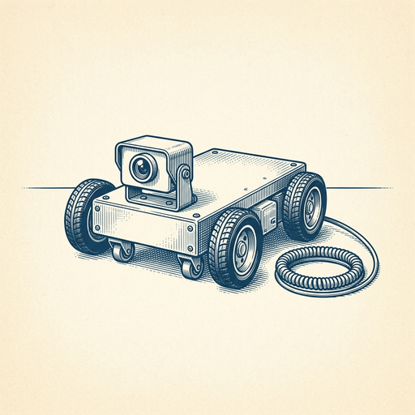
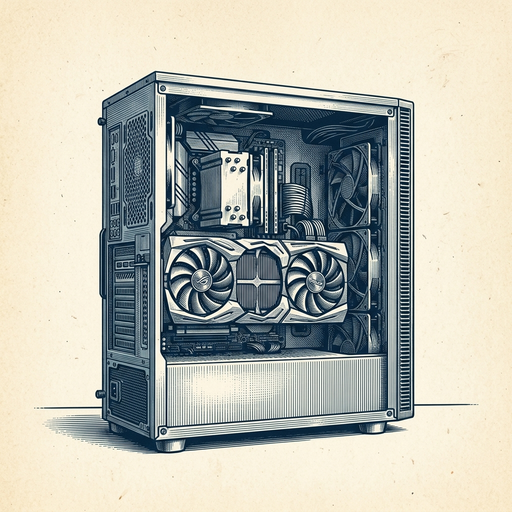
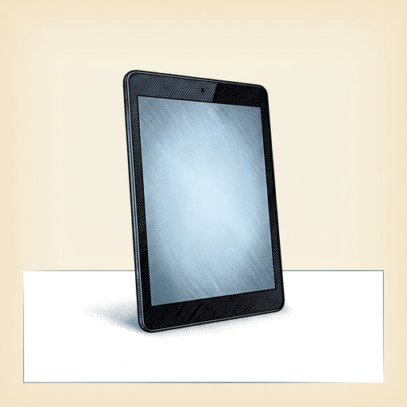

# ai espresso ☕ — Edition 111 · Variant C (Newspaper Comic · Snackable)

*your morning cup of AI*
**THU · OCT 8 · 2026**

---


**NEWS**

## ChatGPT can now answer you with buttons, charts, and fill-in forms

OpenAI's new Intelligent UI feature lets ChatGPT respond with interactive elements instead of just text — diagrams, charts, tappable buttons, and forms you can fill out right in the chat. Rolling out now to all users alongside GPT-6.

*ChatGPT just became an interface builder, not just a text generator.*

[The Verge — AI](https://www.theverge.com/ai-artificial-intelligence/1007276/openai-chatgpt-intelligent-ui-gpt-6) · Oct 8

---



**NEWS**

## AWS just open-sourced a toolchain for building physical robots that see and decide

Amazon released the Physical AI Toolchain, an open-source stack that lets manufacturers build machines that can perceive their environment, reason about what they see, and take action. It runs on AWS and targets companies building warehouse robots, inspection drones, and other autonomous hardware.

*Making physical AI development open-source could speed up how fast robots move from labs into factories and warehouses.*

[Amazon News (About Amazon)](https://www.aboutamazon.com/news/aws/aws-physical-ai-toolchain-build-intelligent-machines?utm_source=rss) · Oct 8

---



**NEWS**

## NVIDIA and Microsoft are building AI agents that run entirely on your Windows PC

Jensen Huang and Satya Nadella announced a partnership to co-engineer hardware and software so AI agents can run locally on Windows PCs with NVIDIA RTX GPUs. The companies are calling it RTX Spark, positioning local AI as the next evolution of the Windows platform.

*AI that runs on your machine instead of the cloud means faster responses and no data leaving your device.*

[NVIDIA Blog](https://blogs.nvidia.com/blog/local-ai-rtx-spark-microsoft-windows-event/) · Oct 8

---


**NEWS**

## Google just launched a Gemini agent that runs your work tasks in the background

Google's new universal Gemini agent works across apps and devices without you watching it. Available in Gemini Enterprise, you chat with it once, assign tasks, and it executes them while you do other things—no need to keep a window open or stay in one app.

*First major workplace agent that actually runs autonomously across your full work stack.*

[The Verge — AI](https://www.theverge.com/tech/1007904/google-gemini-ai-agent-enterprise) · Oct 8

---



**NEWS**

## Amazon just put Alexa+ AI into new tablets with full Android apps

Amazon's new tablet lineup comes with Alexa+, the upgraded AI assistant that can handle multi-step tasks and remember context across conversations. They run full Android with Google Play Store access, so you get both Amazon's AI layer and every Android app—not just Amazon's ecosystem.

*First mainstream tablets shipping with a conversational AI assistant baked into the hardware.*

[Amazon News (About Amazon)](https://www.aboutamazon.com/news/devices/new-amazon-alexa-tablets-alexa-plus?utm_source=rss) · Oct 8

---


**NEWS**

## Cohere just shipped an AI platform that runs inside your own infrastructure

North 2 lets enterprises deploy Cohere's models and agents directly in their private cloud or data center. You get the same reasoning and tool-use capabilities as the API version, but nothing leaves your perimeter — no data goes to Cohere's servers, and you control cost, compliance, and how models connect to internal systems.

*First major model vendor to ship a full agentic stack you can run entirely on-prem.*

[Cohere Blog](https://cohere.com/blog/introducing-north-2) · Oct 8

---


---


**☕ Try this prompt**

### The strategy stress-test

*Before you present the roadmap, not after the market proves you wrong.*


```
I'll describe our current strategy below. Challenge it like a hostile board member: tell me the one assumption that sounds smart but is probably wishful thinking, the competitor move that would break our plan, and the resource we're underinvesting in because it's uncomfortable to admit we need it.
```

---

*brewed by ai espresso · [spot something off?](mailto:jhimel@solvd.com?subject=AI%20Espresso%20issue%20report) · [repo](https://github.com/jackiehimel/AI-espresso-agent)*
