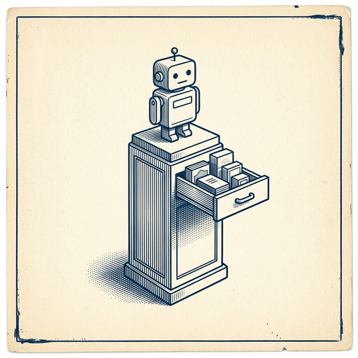

# ai espresso ☕ — Edition 11 · Variant C (Newspaper Comic · Snackable)

*your morning cup of AI*
**SUN · JUN 7 · 2026**

---


**NEWS**

## Google will pay SpaceX $920M per month for compute

Google signed a deal to pay SpaceX nearly a billion dollars monthly for computing power, citing unexpected demand for its new AI products. The arrangement suggests Google's existing data center capacity can't keep up with how fast people are adopting its AI tools.

*AI demand is now so intense that even Google needs to rent compute from a rocket company.*

[TechCrunch — AI](https://techcrunch.com/2026/06/05/google-will-pay-spacex-920m-per-month-for-compute/) · Jun 7

---


**NEWS**

## Cursor SDK now lets you ship agents that review their own code

Cursor's TypeScript and Python SDKs added auto-review (agents can critique their own output before committing), custom tools, nested subagents, and custom stores for state. You also get run correlation IDs for tracing multi-step workflows and lighter imports that speed up cold starts.

*Auto-review means agents can catch their own mistakes before you do—closer to self-correcting automation.*

[Cursor Changelog (official)](https://cursor.com/changelog/sdk-updates-jun-2026) · Jun 7

---


**NEWS**

## Companies are panicking over AI bills they can't predict or control

After months of 'move fast' AI deployments, enterprises are hitting surprise six-figure token bills with no way to forecast spend. Teams that encouraged experimentation now scramble for usage caps, model downgrades, and kill switches as CFOs demand answers no one has.

*The gold rush phase is over — now comes the part where someone has to explain the bill.*

[TechCrunch — AI](https://techcrunch.com/2026/06/05/the-token-bill-comes-due-inside-the-industry-scramble-to-manage-ais-runaway-costs/) · Jun 7

---



**NEWS**

## OpenAI is about to redesign ChatGPT as a selling tool for premium products

The company plans its biggest ChatGPT overhaul since 2022, turning the chatbot into a gateway that funnels users toward higher-margin offerings like enterprise tools and API access. The move comes as OpenAI eyes a potential IPO.

*ChatGPT stops being just a product and becomes the storefront for everything else OpenAI sells.*

[FT — Technology](https://www.ft.com/content/ca0f5f5e-fb9a-41a0-a2a9-0127e15b7db9) · Jun 7

---


---


**☕ Try this prompt**

### Try this prompt

*Works in Claude, ChatGPT, or Gemini.*


```
(prompt generation failed — re-run the edition agent)
```

---

*brewed by ai espresso · [spot something off?](mailto:jhimel@solvd.com?subject=AI%20Espresso%20issue%20report) · [repo](https://github.com/jackiehimel/AI-espresso-agent)*
