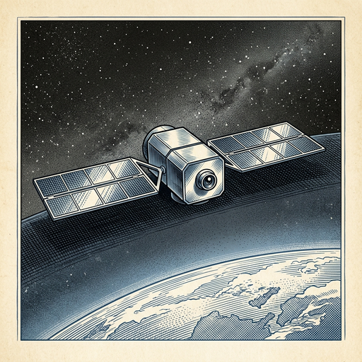

# ai espresso ☕ — Edition 20 · Variant C (Newspaper Comic · Snackable)

*your morning cup of AI*
**MON · JUN 15 · 2026**

---


**NEWS**

## Apple just shipped AI photo editing to a billion iPhones

iOS 27 adds AI tools to reframe, extend, and clean up photos — less aggressive than Google's Pixel edits, but now in the hands of the world's most popular camera. The Verge tested them and found they mostly work as advertised, which means casual photo manipulation just went mainstream.

*When Apple ships a feature to everyone, it becomes normal behavior overnight.*

[The Verge — AI](https://www.theverge.com/tech/949360/apple-ai-photo-edit-reframe-extend-clean-up-hands-on) · Jun 15

---


**NEWS**

## NewCore raises $66M to give AI agents employee IDs and permissions

As companies deploy AI agents that book meetings, write code, and access databases, NewCore is building identity management for bots—think Okta, but for agents instead of people. The startup argues the next enterprise security challenge isn't managing human logins, it's controlling which agents can do what across your systems.

*AI agents need the same access controls as employees, and existing tools weren't built for that.*

[TechCrunch — AI](https://techcrunch.com/2026/06/15/ai-agents-are-becoming-employees-newcore-emerges-with-66m-to-give-them-identities/) · Jun 15

---



**NEWS**

## A satellite just taught itself to spot objects from orbit

In April, an Earth observation satellite identified a target on its own for the first time—no ground control needed. The satellite processed imagery onboard using AI, decided what mattered, and acted autonomously. Previous satellites beam everything down for humans to sort through.

*Satellites can now make decisions in space instead of waiting for instructions from Earth.*

[TechCrunch — AI](https://techcrunch.com/2026/06/15/a-satellite-just-learned-to-find-things-on-its-own-heres-what-that-means/) · Jun 15

---


**NEWS**

## Salesforce is buying AI customer service startup Fin for $3.6 billion

Salesforce agreed to acquire Fin, which builds AI-powered customer service agents, for $3.6 billion. The deal is part of Salesforce's push to expand its enterprise AI offerings and compete for companies looking to automate customer support with conversational agents.

*Salesforce is betting billions that companies will pay for AI that talks to their customers*

[Bloomberg Technology](https://www.bloomberg.com/news/articles/2026-06-15/salesforce-to-buy-ai-customer-service-firm-fin-for-3-6-billion) · Jun 15

---


---


**☕ Try this prompt**

### The strategy stress test

*Before you commit the roadmap or the budget.*


```
I'll describe our strategy below. Now tell me: what has to stay true about the world for this to work? List three assumptions we're betting on. Then pick the one most likely to break in the next 18 months and tell me what we'd do if it did.
```

---

*brewed by ai espresso · [spot something off?](mailto:jhimel@solvd.com?subject=AI%20Espresso%20issue%20report) · [repo](https://github.com/jackiehimel/AI-espresso-agent)*
