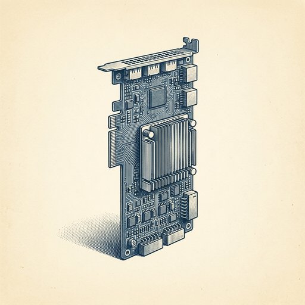

# ai espresso ☕ — Edition 21 · Variant C (Newspaper Comic · Snackable)

*your morning cup of AI*
**TUE · JUN 23 · 2026**

---


**NEWS**

## Anthropic launches Claude Tag to track AI activity across your company

Claude Tag lets you add a tracking snippet to your app so you can see which teams use Claude, what prompts they run, and how much it costs. Works across API, web, and mobile — giving admins a single dashboard for usage, spend, and compliance.

*Finally a way to know who's actually using Claude and what they're building with it.*

[Anthropic News](https://www.anthropic.com/news/introducing-claude-tag) · Jun 23

---


**NEWS**

## Meta just launched smart glasses without Ray-Ban

After three years of Ray-Ban exclusivity, Meta is shipping its own-brand smart glasses in three styles and seven colors. The Verge got hands-on with the new frames, which drop the Ray-Ban partnership but keep Meta's AI features. One style is a collab with a celebrity influencer.

*Meta's betting it can sell smart glasses on AI alone, not just fashion branding.*

[The Verge — AI](https://www.theverge.com/tech/954052/meta-glasses-hands-on-kylie-jenner-smart-glasses-price-battery-privacy) · Jun 23

---



**NEWS**

## Groq raised $650M and hired new execs after Nvidia bought its team for $20B

The AI chip startup confirmed a new funding round and executive hires after Nvidia paid $20 billion mostly for Groq's engineering talent. Groq is now focusing on its neocloud business—letting customers rent its inference chips instead of buying hardware.

*A startup can survive losing its entire team if the tech and business model still work*

[TechCrunch — AI](https://techcrunch.com/2026/06/22/ai-chipmaker-groq-confirms-650m-raise-re-staffs-after-nvidias-20b-not-acqui-hire-deal/) · Jun 23

---


**NEWS**

## Google DeepMind just paid A24 $75M to build AI filmmaking tools

Google DeepMind and indie studio A24 (Everything Everywhere All at Once, The Whale) are partnering to develop AI tools for film production. The $75 million deal marks one of the biggest bets yet on AI entering Hollywood's creative pipeline.

*Major studios are now paying real money to figure out where AI fits in actual filmmaking.*

[TechCrunch — AI](https://techcrunch.com/2026/06/22/google-deepmind-bets-75m-on-ais-future-in-hollywood-with-a24-deal/) · Jun 23

---


---


**☕ Try this prompt**

### The negotiation flip

*Before salary talks, vendor deals, or any conversation where you're about to anchor too early.*


```
I'm preparing for a negotiation I'll describe below. Don't tell me what to ask for. Instead: tell me what the other side actually wants that I haven't thought about, what I could offer that costs me little but they'd value highly, and the one concession I should refuse even if it feels small.
```

---

*brewed by ai espresso · [spot something off?](mailto:jhimel@solvd.com?subject=AI%20Espresso%20issue%20report) · [repo](https://github.com/jackiehimel/AI-espresso-agent)*
