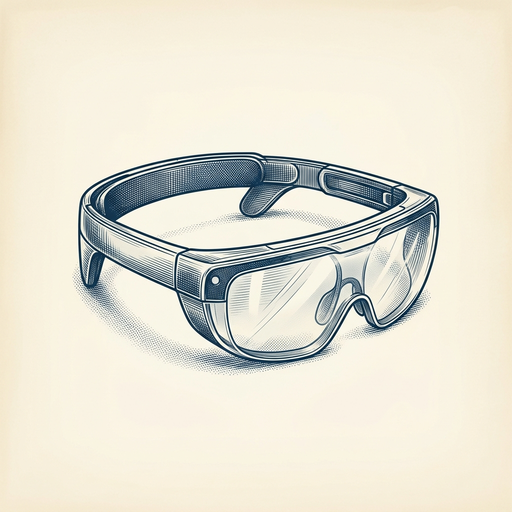
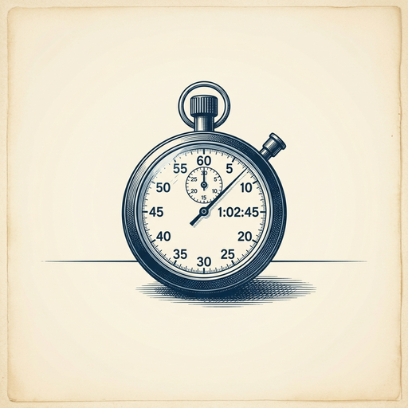

# ai espresso ☕ — Edition 22 · Variant C (Newspaper Comic · Snackable)

*your morning cup of AI*
**WED · JUN 17 · 2026**

---



**NEWS**

## NVIDIA ships a framework to put AI agents in AR glasses

NVIDIA XR AI, now in public beta, lets developers build multimodal AI agents that run on AR glasses and XR devices. Think: hands-free assistants that can see what you see, hear what you hear, and respond in real time through your headset.

*AI agents are moving from your phone screen to your field of view.*

[NVIDIA Blog](https://blogs.nvidia.com/blog/nvidia-xr-ai/) · Jun 17

---


**NEWS**

## Pinterest just launched a chatbot that shops for you

The company's new experimental app, Ask Pinterest, lets you describe what you're looking for in plain language and get product recommendations through conversation. Instead of scrolling through boards, you chat with AI that pulls from Pinterest's catalog of shoppable items.

*Shopping by chatting instead of searching could stick if the recommendations actually match what you want.*

[TechCrunch — AI](https://techcrunch.com/2026/06/17/pinterest-launches-an-experimental-ai-shopping-app-called-ask-pinterest/) · Jun 17

---


**NEWS**

## Android 17 brings Gemini AI into split-screen and live call transcripts

Google's new Android update lets you run Gemini in split-screen mode while using other apps, and adds live call transcription that works entirely on-device. The Pixel Drop also brings Google's latest AI models to Pixel phones, including improved photo editing and smarter assistant responses.

*AI assistants can finally multitask the way you actually work on a phone.*

[TechCrunch — AI](https://techcrunch.com/2026/06/16/android-17-launches-with-new-multitasking-tools-as-google-expands-gemini-features/) · Jun 17

---


**NEWS**

## Uber is bringing driverless rides to Houston with Lucid and Nuro

Uber will offer robotaxi rides in Houston using vehicles from Lucid and Nuro, competing directly with Waymo in the nation's fourth-largest city. The partnership puts three players into Houston's autonomous vehicle market as the race to scale driverless rides beyond San Francisco and Phoenix heats up.

*The robotaxi market is expanding beyond its early West Coast testing grounds into major metros*

[Bloomberg Technology](https://www.bloomberg.com/news/articles/2026-06-17/uber-lucid-and-nuro-plan-robotaxis-in-houston-taking-on-waymo-in-no-4-us-city) · Jun 17

---


**NEWS**

## Facebook's new AI Mode trains on your public posts

Meta is rolling out AI Mode in Facebook search, which generates answers using public posts from users across the platform. It appears alongside regular search filters like People and Marketplace, and is part of a broader AI features release that includes photo presets for swapping sports jerseys and other edits.

*Your public Facebook posts are now training data for search results other users see.*

[The Verge — AI](https://www.theverge.com/tech/950264/meta-ai-mode-search-facebook) · Jun 17

---



**NEWS**

## NVIDIA's Blackwell chips just set every AI training speed record

NVIDIA's new Blackwell GPUs swept MLPerf Training 6.0, the industry benchmark for how fast hardware can train AI models. Blackwell systems completed training runs faster than any prior chip across every category tested, from small language models to massive multi-trillion-parameter workloads.

*Faster training means teams can iterate on models in hours instead of days.*

[NVIDIA Blog](https://blogs.nvidia.com/blog/blackwell-mlperf-training-6-0/) · Jun 17

---


---


**☕ Try this prompt**

### The hiring red-flag finder

*Run this after interviews, before you make the offer.*


```
I'm interviewing candidates for a role I'll describe below. I've narrowed it to two finalists who both seem great on paper. For each one, tell me the single biggest risk I'm not seeing — the thing that won't show up until month three — and the one question I should've asked but probably didn't.
```

---

*brewed by ai espresso · [spot something off?](mailto:jhimel@solvd.com?subject=AI%20Espresso%20issue%20report) · [repo](https://github.com/jackiehimel/AI-espresso-agent)*
