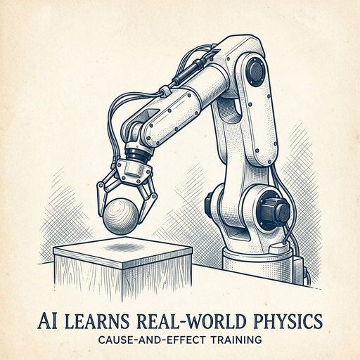

# ai espresso ☕ — Edition 23 · Variant C (Newspaper Comic · Snackable)

*your morning cup of AI*
**THU · JUN 18 · 2026**

---


**NEWS**

## Google's Gemini co-lead Noam Shazeer just jumped to OpenAI

Noam Shazeer, Google's VP of engineering who co-led the Gemini model family, announced Wednesday he's leaving for OpenAI. Shazeer was one of the original Transformer authors and co-founded Character.AI before Google bought him back last year for $2.7 billion.

*One of AI's most influential researchers is switching sides in the middle of the model race.*

[CNBC — Technology](https://www.cnbc.com/2026/06/18/google-gemini-co-lead-noam-shazeer-leaves-for-openai.html) · Jun 18

---


**NEWS**

## Google's medical AI now matches real doctors at managing chronic disease

AMIE, Google's conversational health AI, performed as well as primary care physicians in managing complex conditions like diabetes and heart disease, according to research published in Nature. The AI handled tasks like adjusting medications, ordering tests, and creating treatment plans across simulated patient scenarios.

*AI could soon handle routine care decisions, not just answer medical questions.*

[Google AI Blog](https://blog.google/innovation-and-ai/models-and-research/google-research/amie-for-disease-management-in-nature/) · Jun 18

---


**NEWS**

## AWS just shipped two new tools to help companies run AI agents at scale

AWS Continuum lets you coordinate multiple agents across workflows, while AWS Context gives agents access to your company's internal data and systems. Both are designed to move agents beyond one-off demos into production use across entire organizations.

*Running agents in real companies requires orchestration and context—AWS is packaging both.*

[Amazon News (About Amazon)](https://www.aboutamazon.com/news/aws/aws-summit-nyc-2026-ai-agents?utm_source=rss) · Jun 18

---


**NEWS**

## ChatGPT now lets you schedule prompts to run automatically

OpenAI added a 'Scheduled Tasks' hub where you can set ChatGPT prompts to run on a timer—daily summaries, weekly reports, or any recurring prompt you'd normally remember to run manually. It's basically cron jobs for your AI assistant.

*Turns ChatGPT from a chat tool into something that works in the background for you.*

[Engadget — AI](https://www.engadget.com/2196844/chatgpt-now-has-a-hub-for-scheduled-tasks/) · Jun 18

---



**NEWS**

## Amazon backs world-model startup Odyssey at $1.45B valuation

Odyssey, which builds AI that learns how the physical world works instead of just predicting text, raised funding from Amazon and other backers at a $1.45 billion valuation. World models let AI simulate cause-and-effect in video, robotics, and environments — going beyond what language models can do.

*Big tech is betting serious money that the next AI leap isn't more chatbots, but systems that understand physics.*

[TechCrunch — AI](https://techcrunch.com/2026/06/17/world-model-maker-odyssey-nabs-1-45b-valuation-backed-by-amazon-and-other-big-names/) · Jun 18

---


**NEWS**

## Google's new $100 speaker ditches 'Hey Google' for actual conversations

Google Home Speaker replaces rigid voice commands with Gemini AI that handles natural conversation. Instead of memorizing exact phrases, you can talk to it like a person—ask follow-ups, change your mind mid-sentence, or just ramble until it figures out what you want.

*Smart speakers might finally work the way people actually talk.*

[TechCrunch — AI](https://techcrunch.com/2026/06/17/google-bets-on-gemini-to-reinvent-the-smart-home-speaker/) · Jun 18

---


---


**☕ Try this prompt**

### The meeting cost calculator

*Before you send the next calendar hold.*


```
I'll describe a recurring meeting below — who attends, how long it runs, how often we do it. Estimate the annual salary cost of that meeting, then tell me: the one decision it needs to produce to justify that price tag, and what we should kill if it's not producing that decision.
```

---

*brewed by ai espresso · [spot something off?](mailto:jhimel@solvd.com?subject=AI%20Espresso%20issue%20report) · [repo](https://github.com/jackiehimel/AI-espresso-agent)*
