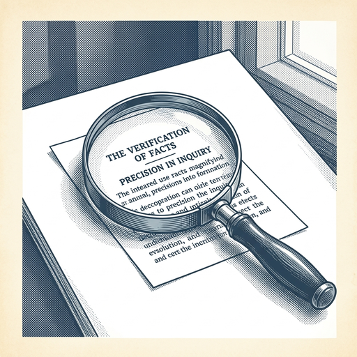

# ai espresso ☕ — Edition 25 · Variant C (Newspaper Comic · Snackable)

*your morning cup of AI*
**SAT · JUN 20 · 2026**

---


**NEWS**

## Nobel Prize-winning AI scientist John Jumper leaves DeepMind for Anthropic

John Jumper, who won the 2024 Nobel Prize in chemistry for AlphaFold, is leaving Google DeepMind to join Anthropic. Jumper's protein-folding AI revolutionized biology research and has been used by millions of scientists worldwide.

*Anthropic just landed one of the most decorated AI researchers in the world*

[Bloomberg Technology](https://www.bloomberg.com/news/articles/2026-06-19/nobel-winner-john-jumper-to-leave-google-deepmind-for-anthropic) · Jun 20

---


**NEWS**

## Adobe's Firefly can now remember your brand and reuse it across projects

Adobe launched a redesigned Firefly studio in private beta that keeps context across sessions — meaning the AI remembers your fonts, colors, and style choices instead of starting from scratch each time. You can now edit and generate designs in one interface with assets that carry over between projects.

*AI creative tools are moving from one-off generators to persistent workspaces that actually fit real workflows.*

[The Verge — AI](https://www.theverge.com/tech/952104/adobe-firefly-ai-agent-elements-projects-update) · Jun 20

---


**NEWS**

## Siri can finally hold a conversation and actually help

Apple's revamped Siri uses AI to handle follow-up questions, understand context across apps, and give useful answers instead of just web links. It's now conversational enough to feel like talking to an assistant rather than shouting commands at your phone.

*Voice assistants might finally work the way people always hoped they would.*

[Wired — AI](https://www.wired.com/story/siri-ai-hands-on-iphone/) · Jun 20

---


**NEWS**

## AI startups ditch Nvidia to train physics models on Amazon's Trainium chips

A wave of AI companies building models that simulate the physical world—not just chatbots—are choosing Amazon's custom Trainium chips over Nvidia GPUs for training. The startups say Trainium offers better price-performance for their specific workloads, especially for models that need to understand physics, chemistry, and 3D environments.

*Custom chips are breaking Nvidia's lock on AI training for specialized use cases beyond language models.*

[Amazon News (About Amazon)](https://www.aboutamazon.com/news/aws/why-ai-startups-choose-amazon-trainium-chips?utm_source=rss) · Jun 20

---


**NEWS**

## UnitedHealth is spending $3 billion to have AI call doctors for patients

The insurer is deploying AI to read medical charts aloud to nurses, analyze millions of customer calls for complaint patterns, and even phone doctors' offices to schedule appointments. The $3 billion push aims to cut costs and address mounting customer backlash over denials and service issues.

*Health insurance automation is moving from back-office claims to direct patient interaction.*

[Bloomberg Technology](https://www.bloomberg.com/news/articles/2026-06-19/unitedhealth-bets-3-billion-on-ai-to-cut-costs-tame-backlash) · Jun 20

---



**NEWS**

## MIT-licensed GLM-5.2 hallucinates 3x less than GPT-5.5

A new open-source model from Tsinghua University outperforms OpenAI's latest on factual accuracy benchmarks, with significantly fewer hallucinations across tested prompts. The MIT license means developers can use it commercially without restrictions.

*You can now ship production AI features with better accuracy and full commercial rights than closed models.*

[Hacker News (front page)](https://arrowtsx.dev/bigger-models/) · Jun 20

---


---


**☕ Try this prompt**

### The priority audit

*When your todo list is all red and nothing feels like the right next move.*


```
I'll list everything on my plate this week below. For each item, tell me: is this urgent because it actually matters, or urgent because I let it become urgent? Then rank them by regret potential — what will I wish I'd done first when I look back in three months?
```

---

*brewed by ai espresso · [spot something off?](mailto:jhimel@solvd.com?subject=AI%20Espresso%20issue%20report) · [repo](https://github.com/jackiehimel/AI-espresso-agent)*
