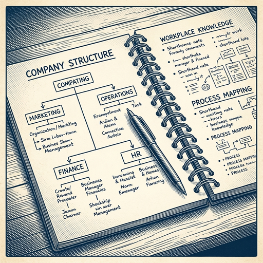
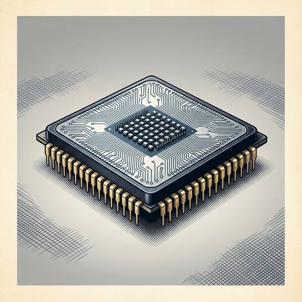

# ai espresso ☕ — Edition 27 · Variant C (Newspaper Comic · Snackable)

*your morning cup of AI*
**WED · JUN 24 · 2026**

---


**NEWS**

## SK Hynix plans $29 billion US listing to fund AI chip production

The South Korean memory chipmaker filed to raise $29.4 billion in a US stock offering set to begin trading July 10. If completed at current exchange rates, it would rank among the five largest IPOs ever recorded. The company supplies high-bandwidth memory chips critical for AI accelerators.

*Shows how much capital chipmakers need to keep pace with AI data center buildout.*

[Bloomberg Technology](https://www.bloomberg.com/news/videos/2026-06-24/sk-hynix-seeks-to-raise-29-billion-in-us-listing-video) · Jun 24

---



**NEWS**

## Claude can now read your entire Slack history to learn how your company works

Anthropic launched Claude Tag for Slack—an AI that watches conversations across channels to build a map of your org's workflows, jargon, and decision-making patterns. Unlike bots you summon, this one sits in channels learning context so it can answer questions about projects, processes, or who owns what without anyone teaching it first.

*The real product isn't chat replies—it's a model trained on your company's actual operating system.*

[TechCrunch — AI](https://techcrunch.com/2026/06/23/anthropics-claude-tag-is-learning-your-company-one-slack-message-at-a-time/) · Jun 24

---



**NEWS**

## China just built the world's fastest supercomputer without any GPUs

A Shenzhen machine reclaimed the top spot on the global supercomputer rankings for the first time since 2017, running entirely on standard CPUs instead of the graphics chips that power most AI training today. The achievement comes as U.S. export controls have blocked China from buying advanced Nvidia hardware.

*Shows China can compete in high-performance computing even when cut off from cutting-edge AI chips.*

[NYT — Technology](https://www.nytimes.com/2026/06/23/technology/china-supercomputer-crown-us.html) · Jun 24

---


**NEWS**

## OpenAI launches bug-hunting program to patch open-source vulnerabilities

OpenAI unveiled a new initiative called 'Patch the Planet' that uses an upgraded GPT-5.5-Cyber model to find and fix security bugs in open-source software. The move directly challenges Anthropic's cybersecurity reputation as concerns grow about AI models' ability to exploit vulnerabilities.

*AI companies are now competing to prove their models make software safer, not just riskier.*

[Wired — AI](https://www.wired.com/story/openai-launches-full-scale-effort-to-patch-open-source-bugs-as-it-takes-on-anthropics-mythos/) · Jun 24

---


**NEWS**

## SpaceX is renting out its Colossus supercomputer for $150M a month

Reflection AI, an open-source lab, just signed a three-year deal to use SpaceX's Colossus 2 data center in Memphis, starting July 1. The arrangement gives Reflection immediate access to Nvidia's latest GB300 chips—$150 million per month through 2029.

*SpaceX is now competing directly with hyperscalers as a compute landlord for frontier AI labs.*

[TechCrunch — AI](https://techcrunch.com/2026/06/22/spacex-inks-compute-deal-with-reflection-ai-an-open-source-ai-lab/) · Jun 24

---


**NEWS**

## Nvidia's new data center design ditches water cooling entirely

Nvidia says its Rubin generation reference design uses liquid cooling that runs hotter than traditional systems, eliminating water consumption in AI data centers. The shift addresses mounting public concern over data centers' environmental footprint, though energy use remains a separate challenge.

*Data centers won't need municipal water supplies if this design becomes standard.*

[The Verge — AI](https://www.theverge.com/tech/954139/nvidia-data-centers-rubin-liquid-cooling) · Jun 24

---


---


**☕ Try this prompt**

### The delegation audition

*When you're the bottleneck but convinced no one else can do it right.*


```
I'll describe a responsibility I'm still doing myself. Don't tell me to delegate it — I know that already. Instead: write the job description for the person who'd own it, estimate how long it would take them to be better at it than me, and name the one thing I'm not willing to let go of yet.
```

---

*brewed by ai espresso · [spot something off?](mailto:jhimel@solvd.com?subject=AI%20Espresso%20issue%20report) · [repo](https://github.com/jackiehimel/AI-espresso-agent)*
