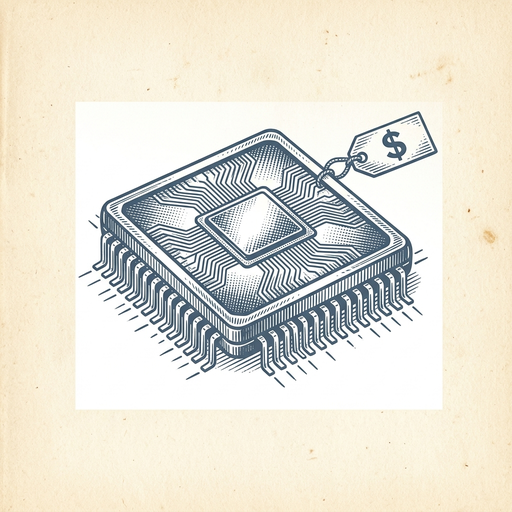
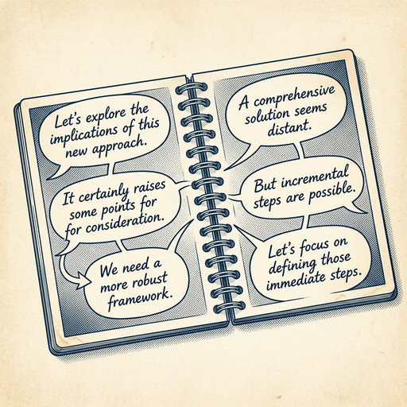
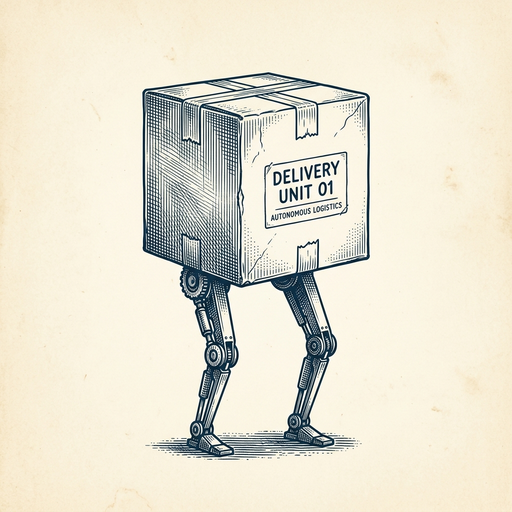

# ai espresso ☕ — Edition 28 · Variant C (Newspaper Comic · Snackable)

*your morning cup of AI*
**THU · JUN 25 · 2026**

---


**NEWS**

## Gemini can now click around your computer like Anthropic's Claude

Google just shipped computer use to Gemini 3.5 Flash, letting the model control your mouse and keyboard to complete tasks across apps. It's rolling out in AI Studio and Vertex AI first, following Anthropic's Claude launch from last fall. The feature works by having Gemini take screenshots, decide what to click, and execute actions step by step.

*The two leading frontier labs now both offer agents that can drive your desktop.*

[Google DeepMind Blog](https://deepmind.google/blog/introducing-computer-use-in-gemini-3-5-flash/) · Jun 25

---



**NEWS**

## Qualcomm buys AI chip startup Modular for $4 billion

Qualcomm is acquiring Modular, a startup that makes software to run AI models across different chips. The nearly $4 billion deal is one of the biggest AI acquisitions yet and gives Qualcomm tools to compete with Nvidia's CUDA software, which has locked developers into Nvidia's hardware.

*Chip makers are now paying billions for the software layer that connects AI models to hardware.*

[Wired — AI](https://www.wired.com/story/qualcomm-buys-buzzy-chip-startup-modular-for-nearly-dollar4-billion/) · Jun 25

---



**NEWS**

## ChatGPT's free tier just got smarter at following conversations

OpenAI upgraded the default free model to GPT-5.5, which better tracks what you've said across a thread. If you use ChatGPT without paying, responses should now feel more coherent when you're building on earlier messages.

*The free tier finally catches up on context—fewer times repeating yourself mid-conversation.*

[Engadget — AI](https://www.engadget.com/2201255/openai-gpt-5-5-instant-chatgpt-upgrade/) · Jun 25

---


**NEWS**

## Figma just added AI motion graphics and shader tools to its canvas

Figma announced design and coding updates at Config 2026, including AI-powered motion graphics and shader tools. The redesigned canvas now supports full-stack development, bringing design teams, AI agents, and development tools into one workspace to automate repetitive tasks.

*Designers can now prototype animations and visual effects without leaving Figma.*

[The Verge — AI](https://www.theverge.com/tech/955831/figma-code-design-tools-config-2026-announcements) · Jun 25

---



**NEWS**

## Agility Robotics is going public at $2.5B — Amazon already uses its humanoid

The company behind Digit, a two-legged warehouse robot that picks and moves boxes, is merging with a SPAC to go public. Amazon and other logistics companies already deploy Digit in facilities, where it handles repetitive tasks alongside human workers.

*Humanoid robots are moving from demos to actual warehouse floors with serious money behind them.*

[WSJ — Tech](https://www.wsj.com/finance/agility-maker-of-humanlike-robots-to-go-public-in-2-5-billion-spac-deal-62c3cb32?mod=rss_Technology) · Jun 25

---


**NEWS**

## Google just lost two more top AI researchers to Anthropic

Jonas Adler and Alexander Pritzel are the latest scientists to leave Google for Anthropic, joining a growing exodus that includes Noam Shazeer and John Jumper. Google's AI brain drain continues as competitors poach the talent that built its foundation.

*The lab that wins top talent often ships the breakthroughs everyone else copies.*

[TechCrunch — AI](https://techcrunch.com/2026/06/24/ai-researchers-continue-to-leave-google-for-its-rivals/) · Jun 25

---


---


**☕ Try this prompt**

### The strategy stress test

*Before you commit budget to a plan everyone's nodding along to.*


```
I'll describe our current strategy below. Attack it like a competitor who wants us to fail. Tell me: the one assumption we're making that's probably wrong, the customer segment we're ignoring that will matter in 18 months, and the capability we lack but keep pretending we'll build later.
```

---

*brewed by ai espresso · [spot something off?](mailto:jhimel@solvd.com?subject=AI%20Espresso%20issue%20report) · [repo](https://github.com/jackiehimel/AI-espresso-agent)*
