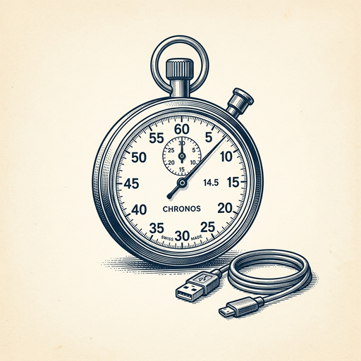

# ai espresso ☕ — Edition 30 · Variant C (Newspaper Comic · Snackable)

*your morning cup of AI*
**SAT · JUN 27 · 2026**

---


**NEWS**

## Anthropic's Mythos 5 is back after two-week Trump admin standoff

After two weeks of negotiations with the Trump administration, Anthropic can deploy Mythos 5 again — but only for select organizations, according to a government letter seen by The Verge. The public version, Fable 5, remains offline.

*A frontier AI model can now be turned off by executive action, then switched back on for chosen customers only.*

[The Verge — AI](https://www.theverge.com/ai-artificial-intelligence/958458/anthropic-mythos-5-is-back-trump-negotiations) · Jun 27

---



**NEWS**

## DeepSeek open-sources the tricks that made its models 60–85% faster

DeepSeek released DSpark, a paper and code showing how they sped up inference by 60–85% using speculative decoding and custom kernels. The techniques work across different model sizes and let you run bigger models on the same hardware without losing quality.

*Open-source speed techniques mean cheaper, faster AI apps without vendor lock-in.*

[Hacker News (front page)](https://github.com/deepseek-ai/DeepSpec/blob/main/DSpark_paper.pdf) · Jun 27

---


**NEWS**

## General Intuition raises $320M to train AI agents by watching video games

The startup is feeding millions of hours of gameplay footage into AI models, betting that watching how humans play games — making split-second decisions, adapting to new scenarios — can teach agents something closer to real-world intuition. The $2.3B valuation suggests investors think game data might be the missing piece for agents that work outside controlled environments.

*If it works, agents trained on gameplay could handle messy real-world tasks better than lab-trained models.*

[TechCrunch — AI](https://techcrunch.com/2026/06/25/general-intuitions-2-3b-bet-that-video-games-can-train-ai-agents-for-the-real-world/) · Jun 27

---


**NEWS**

## Chinese startup Z.ai just undercut OpenAI on price and almost matched on performance

Silicon Valley engineers are switching to Z.ai, a Chinese AI company whose models perform nearly as well as OpenAI and Anthropic but cost significantly less. The company is gaining traction among U.S. developers who prioritize budget over bleeding-edge capability.

*Price competition is now forcing American AI labs to justify premium pricing or match Chinese rates.*

[NYT — Technology](https://www.nytimes.com/2026/06/25/technology/zai-china-artificial-intelligence-models.html) · Jun 27

---


**NEWS**

## Databricks' ex-AI chief built an image generator that uses 1,000x less power

Un-0 is a new image-generation tool that replicates what conventional AI systems do but slashes energy consumption by three orders of magnitude. It's the first public demo of technology aimed at making AI inference radically cheaper and more efficient.

*If this scales, AI could run on devices and in data centers at a fraction of today's cost and carbon footprint.*

[TechCrunch — AI](https://techcrunch.com/2026/06/25/databricks-former-ai-chief-thinks-he-can-cut-ais-power-bill-by-1000x/) · Jun 27

---


**NEWS**

## NVIDIA and AWS just made it cheaper to run AI in production

NVIDIA's latest AWS integration targets the hardest parts of production AI: low-latency inference, fast vector search, and GPU price-performance. The collaboration spans Amazon OpenSearch and EC2, giving enterprises more practical infrastructure that scales without adding operational overhead.

*Production AI is still expensive and complex—this targets both bottlenecks at once.*

[NVIDIA Blog](https://blogs.nvidia.com/blog/nvidia-aws-ai-production-scale/) · Jun 27

---


---


**☕ Try this prompt**

### The hiring red flag translator

*When your instinct says no but you need words for the debrief.*


```
I just interviewed a candidate and something felt off, but I can't articulate it. Here's what they said and did during the conversation. Don't tell me to trust my gut. Instead: name the specific concern my gut is detecting, give me one follow-up question that would confirm or dismiss it, and tell me what good looks like on that dimension.
```

---

*brewed by ai espresso · [spot something off?](mailto:jhimel@solvd.com?subject=AI%20Espresso%20issue%20report) · [repo](https://github.com/jackiehimel/AI-espresso-agent)*
