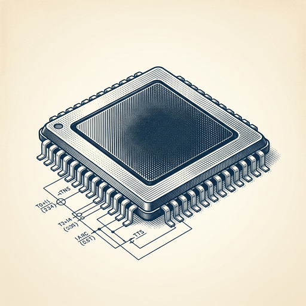

# ai espresso ☕ — Edition 32 · Variant C (Newspaper Comic · Snackable)

*your morning cup of AI*
**MON · JUN 29 · 2026**

---


**NEWS**

## Meta's AI turns brain waves into text without surgery

Meta built Brain2Qwerty, an AI system that reads brain activity through a cap with electrodes and types what someone is trying to say. Early tests show people can 'type' around 30 characters per minute just by thinking about moving their hands to type — no implant required.

*First real alternative to Neuralink's invasive approach for people who can't speak or move.*

[Meta AI Blog](https://ai.meta.com/blog/brain2qwerty-brain-ai-human-communication/) · Jun 29

---



**NEWS**

## OpenAI is building its own chip to run AI models

OpenAI announced Jalapeño, a custom chip built with Broadcom designed to run inference—the part where models actually answer your questions. It joins Google, Apple, and SpaceX in making hardware to reduce dependence on Nvidia, which has dominated AI chips for years.

*Big AI companies are betting they can build cheaper, faster chips than buying off the shelf.*

[TechCrunch — AI](https://techcrunch.com/podcast/openais-jalapeno-chip-is-big-techs-spiciest-move-away-from-nvidia/) · Jun 29

---


**NEWS**

## Google made Gemini Nano run twice as fast on Pixel phones

Google Research found a way to make on-device AI generate text twice as fast by predicting multiple words at once instead of one at a time. The technique, called frozen Multi-Token Prediction, works without retraining the entire model — just adding a small prediction layer on top.

*On-device models can now run faster without burning more battery or needing new hardware.*

[Google Research Blog](https://research.google/blog/accelerating-gemini-nano-models-on-pixel-with-frozen-multi-token-prediction/) · Jun 29

---


**NEWS**

## Ex-Nvidia engineers built a robot that can actually do intern work

Flexion Robotics trained a humanoid robot to handle real office tasks—filing, organizing, basic computer work—by having it learn from watching humans do the job first. The startup's approach skips complex programming and lets the robot pick up tasks the way a new hire would.

*Physical AI that learns by observation could automate entry-level work faster than anyone expected.*

[Wired — AI](https://www.wired.com/story/this-robot-is-going-to-replace-your-interns-flexion/) · Jun 29

---


**NEWS**

## Samsung and SK Hynix commit $880 billion to Korea's AI chip push

South Korea announced a 10-year, $880 billion investment plan from Samsung, SK Hynix, and other companies to build chips and data centers. The government is calling the infrastructure spending essential to compete in the AI era.

*Korea is betting nearly a trillion dollars that chip production and data centers will define AI leadership.*

[Bloomberg Technology](https://www.bloomberg.com/news/articles/2026-06-28/samsung-sk-reportedly-to-invest-1-3-trillion-over-10-years) · Jun 29

---


**NEWS**

## OpenAI just hired Uber's India chief to run its biggest market outside the US

OpenAI brought on Uber India's former head to lead operations in India, which has become the company's largest market after the United States. The move is part of a broader push that includes new offices, partnerships, and aggressive hiring across the country.

*India is now OpenAI's second-biggest market globally, and they're staffing up to match.*

[TechCrunch — AI](https://techcrunch.com/2026/06/26/openai-poaches-uber-india-chief-to-lead-its-biggest-market-outside-the-u-s/) · Jun 29

---


---


**☕ Try this prompt**

### The skill decay detector

*When you've been doing something long enough to forget what good looks like.*


```
I want to get better at something I'll describe below, but I'm not sure what actually needs work. Tell me: the one skill that's probably degraded without me noticing, the blind spot that comes from doing this on autopilot, and a 10-minute drill I can do this week to diagnose where I really stand.
```

---

*brewed by ai espresso · [spot something off?](mailto:jhimel@solvd.com?subject=AI%20Espresso%20issue%20report) · [repo](https://github.com/jackiehimel/AI-espresso-agent)*
