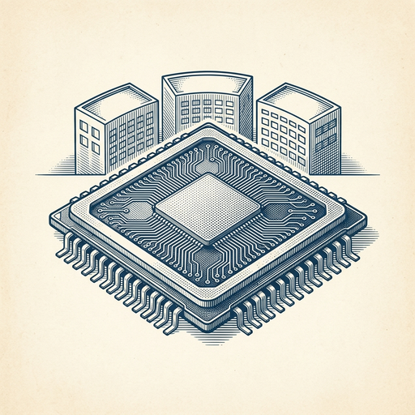

# ai espresso ☕ — Edition 33 · Variant C (Newspaper Comic · Snackable)

*your morning cup of AI*
**TUE · JUN 30 · 2026**

---


**NEWS**

## Cursor just shipped a coding agent straight to your phone

Cursor's new iOS app lets you launch and manage always-on coding agents from anywhere. Available now in public beta for all paid users — meaning you can start a refactor from your couch and check in while you're out.

*Coding agents are no longer desk-bound — you can now kick them off and monitor from mobile.*

[Cursor Changelog (official)](https://cursor.com/changelog/ios-mobile-app) · Jun 30

---


**NEWS**

## Open-source coding agent trains itself by fixing its own mistakes

Ornith-1.0 is a new open-source AI model that improves at writing code by learning from its failures. When it breaks something, it captures the error, figures out what went wrong, and uses that feedback to get better at the task—without human annotation. The team released the model weights and training approach on GitHub.

*Self-improving agents could get better at your codebase the more you use them.*

[Hacker News (front page)](https://github.com/deepreinforce-ai/Ornith-1) · Jun 30

---


**NEWS**

## Google's Gemini can now make images from your personal data — for free

Google opened its personalized AI image generator to all US users. Gemini can now pull from your connected Google apps — photos, docs, calendar — to create images that match your interests and history. Previously required a paid subscription.

*Free AI that knows your context makes custom visuals way easier to generate*

[TechCrunch — AI](https://techcrunch.com/2026/06/29/geminis-personalized-ai-image-generation-is-now-free-for-u-s-users/) · Jun 30

---



**NEWS**

## Claude now runs on NVIDIA's newest Blackwell chips in Azure

Anthropic's Claude models are now generally available in Microsoft Azure running on NVIDIA's GB300 Blackwell Ultra GPUs. Azure customers can now build agents on Claude using NVIDIA's latest hardware without leaving their existing cloud infrastructure.

*Major enterprises can finally use frontier models on cutting-edge chips inside their existing Azure setup.*

[NVIDIA Blog](https://blogs.nvidia.com/blog/anthropic-nvidia-gb300-blackwell-ultra-microsoft-azure/) · Jun 30

---


---


**☕ Try this prompt**

### The reverse roadmap

*When your plan feels like a list of hopes instead of a sequence of dependencies.*


```
I'll describe a goal I want to hit in 90 days. Work backwards from success and build me a timeline in reverse: what has to be true the day before I hit it, one week before, one month before, and right now. Then tell me which milestone is actually the long pole.
```

---

*brewed by ai espresso · [spot something off?](mailto:jhimel@solvd.com?subject=AI%20Espresso%20issue%20report) · [repo](https://github.com/jackiehimel/AI-espresso-agent)*
