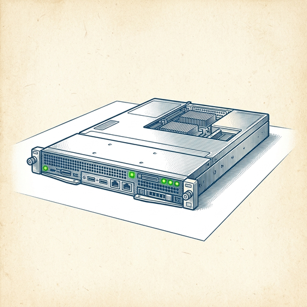
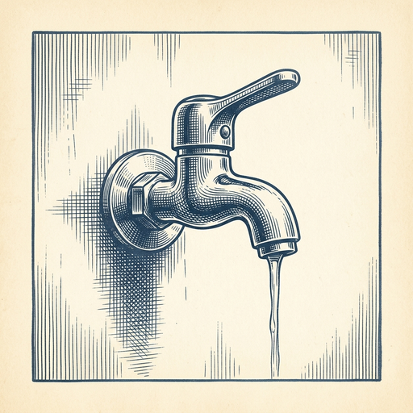

# ai espresso ☕ — Edition 35 · Variant C (Newspaper Comic · Snackable)

*your morning cup of AI*
**FRI · JUL 3 · 2026**

---



**NEWS**

## Anthropic brings Claude Fable 5 back online after Trump admin talks

After weeks of negotiations with the Trump administration, Anthropic is restoring access to Claude Fable 5 starting Wednesday. The model will return globally on Claude platforms and through AWS, Google Cloud, and Microsoft.

*A major AI model was offline for weeks due to government intervention — a new precedent for AI regulation.*

[The Verge — AI](https://www.theverge.com/ai-artificial-intelligence/958964/anthropic-claude-fable-5-is-back) · Jul 3

---


**NEWS**

## Microsoft is spinning out a $2.5B company to deploy AI for other businesses

Microsoft is creating a separate company focused on implementing AI systems for enterprises, following similar moves by Amazon, OpenAI, and Anthropic. The new group gets $2.5 billion in initial funding and will handle the messy work of actually getting models into production at client companies.

*Every major AI company now thinks the real money is in implementation, not just selling API access.*

[TechCrunch — AI](https://techcrunch.com/2026/07/02/microsoft-launches-its-own-ai-deployment-company-with-2-5-billion-commitment/) · Jul 3

---


**NEWS**

## SpaceX built a phone-sized AI device prototype

SpaceX showed investors a 'handset-like' AI device before its IPO, signaling the company may be pushing beyond satellites into consumer hardware. Details are slim, but the prototype suggests SpaceX wants a bigger piece of wireless beyond just selling Starlink connectivity.

*SpaceX could compete directly with phones instead of just providing the network underneath them.*

[TechCrunch — AI](https://techcrunch.com/2026/07/01/spacex-has-an-ai-device-prototype-and-it-sure-sounds-phone-ish/) · Jul 3

---



**NEWS**

## Companies are rate-limiting their own employees' AI use

Internal docs from Amazon, Adobe, Atlassian, and Citi show companies capping how much AI their workers can actually use. The reason: costs are spiraling faster than budgets can handle, forcing the same firms that rolled out AI tools companywide to now throttle access.

*The AI productivity dream hits a hard financial ceiling*

[404 Media](https://www.404media.co/companies-are-throttling-employees-ai-use-because-its-too-expensive/) · Jul 3

---


**NEWS**

## NotebookLM now turns your research notes into 60-second AI video clips

Google's adding TikTok-style vertical videos to NotebookLM for Ultra and Pro subscribers. Upload your sources and the AI generates a minute-long clip summarizing what you fed it—think research brief as a phone video instead of a text summary.

*AI summaries are jumping from text to video format, betting people will actually watch their notes.*

[The Verge — AI](https://www.theverge.com/tech/959778/google-notebooklm-ai-clips) · Jul 3

---


**NEWS**

## Google just released two new Gemini models: one for your phone, one for the cloud

Nano Banana 2 Lite runs entirely on-device for privacy-first tasks like text summarization and smart replies. Gemini Omni Flash is a cloud model optimized for speed and cost, handling text, images, audio, and video in a single API call. Both are available now through Google AI Studio and the Gemini API.

*Developers can now choose between local processing for sensitive data or fast multimodal inference in the cloud.*

[Google DeepMind Blog](https://deepmind.google/blog/start-building-with-nano-banana-2-lite-and-gemini-omni-flash/) · Jul 3

---


---


**☕ Try this prompt**

### The energy audit

*When you're busy but burned out — and can't figure out why.*


```
List my recurring meetings, projects, and responsibilities from the past two weeks. For each one, tell me whether it's giving me energy or draining it. Then show me what my calendar would look like if I protected 60% of my energy-giving work and cut the biggest energy vampire in half.
```

---

*brewed by ai espresso · [spot something off?](mailto:jhimel@solvd.com?subject=AI%20Espresso%20issue%20report) · [repo](https://github.com/jackiehimel/AI-espresso-agent)*
