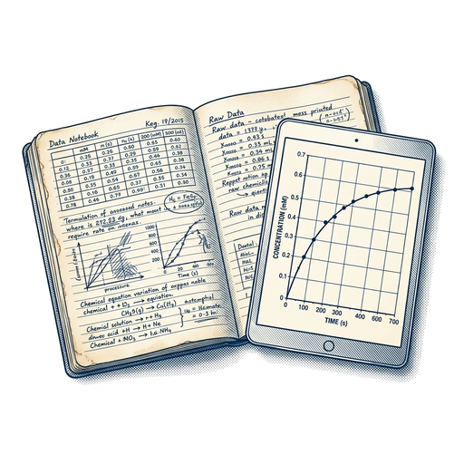

# ai espresso ☕ — Edition 37 · Variant C (Newspaper Comic · Snackable)

*your morning cup of AI*
**SUN · JUL 5 · 2026**

---



**NEWS**

## Anthropic built an AI workbench that turns messy lab data into figures

Claude Science combines scattered datasets and tools into one environment where researchers can generate visuals and run experiments. Anthropic is betting scientists spend too much time wrangling data instead of doing science, and that Claude can handle the grunt work of turning raw results into publication-ready figures.

*If it works, grad students might actually finish their PhDs on time.*

[The Verge — AI](https://www.theverge.com/ai-artificial-intelligence/961311/anthropic-claude-science-ai-drug-development) · Jul 5

---


**NEWS**

## NVIDIA is building giant AI server farms with outside money

NVIDIA announced it's partnering with investors to build what it calls "AI factories" — massive GPU clusters designed to run AI models 24/7 for companies that need compute at scale but don't want to buy their own hardware. The setup targets startups and enterprises moving from model training to running production inference.

*NVIDIA now competes with its own cloud customers by renting GPUs directly to AI companies.*

[NVIDIA Blog](https://blogs.nvidia.com/blog/nvidia-unlocks-ai-compute-at-scale-capital-partners-to-power-ai-infrastructure-buildout/) · Jul 5

---


**NEWS**

## Google DeepMind's first union negotiations hit a wall

Employees at Google DeepMind met with executives Wednesday to discuss unionization, but say leadership refused to engage meaningfully with their demands. Workers expressed frustration with what they described as stonewalling tactics during the initial bargaining session.

*AI labs are facing labor organizing for the first time as researchers demand more say in how their work gets used.*

[Wired — AI](https://www.wired.com/story/google-deepmind-unionization-talks-are-off-to-a-rocky-start/) · Jul 5

---


**NEWS**

## Meta just started charging a subscription for features already on your smart glasses

If you own Ray-Ban Meta glasses, some AI features now require a monthly subscription for "expanded access" — even though the hardware runs on-device. Meta's calling it a tier for advanced capabilities, but you already paid for the glasses.

*Hardware you own is becoming a gateway to recurring fees, not a one-time purchase.*

[Wired — AI](https://www.wired.com/story/why-meta-is-charging-a-subscription-for-on-device-smart-glasses-features/) · Jul 5

---


---


**☕ Try this prompt**

### The negotiation floor-finder

*Before salary talks, vendor contracts, or any deal where you might cave.*


```
I'm about to negotiate something and I'll describe the situation below. Don't tell me tactics. Instead: tell me the number or term I should never go below, explain why that's the floor, and give me one sentence I can say out loud when someone pushes past it.
```

---

*brewed by ai espresso · [spot something off?](mailto:jhimel@solvd.com?subject=AI%20Espresso%20issue%20report) · [repo](https://github.com/jackiehimel/AI-espresso-agent)*
