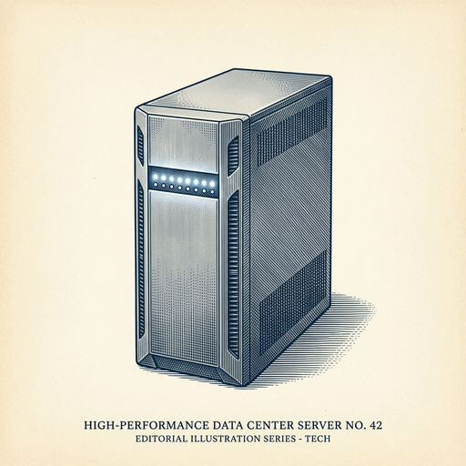
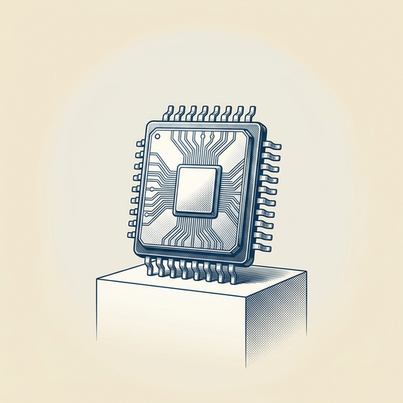

# ai espresso ☕ — Edition 40 · Variant C (Newspaper Comic · Snackable)

*your morning cup of AI*
**WED · JUL 8 · 2026**

---



**NEWS**

## OpenAI will release GPT-5.6 to the public on July 9

OpenAI's next model — GPT-5.6, with variants called Sol, Terra, and Luna — goes live Thursday. The company received regulatory approval to make it widely available, though details on capabilities and pricing haven't been announced yet.

*First public GPT-5 release marks OpenAI's next major model generation*

[Engadget — AI](https://www.engadget.com/2210308/openai-rolls-out-gpt5-6-july-9/) · Jul 8

---


**NEWS**

## Meta just open-sourced an AI that generates images and video faster than anything else

Meta released Muse Image and Muse Video, new models that create images in 0.3 seconds and videos in under 2 seconds—up to 10x faster than competitors. Both use a technique called Masked Generative Transformers that predicts multiple parts of an image at once instead of building pixel-by-pixel. Code and model weights are public.

*Speed like this makes real-time creative tools and interactive AI apps actually practical.*

[Meta AI Blog](https://ai.meta.com/blog/introducing-muse-image-muse-video-msl/) · Jul 8

---


**NEWS**

## Google's Gemini API now lets agents run tasks in the background

Google expanded its managed agents feature to handle long-running tasks without keeping a connection open. Agents can now execute background jobs, connect to remote MCP servers, and maintain state across sessions—so you can kick off a complex workflow and check back later instead of babysitting the process.

*Agents that can work asynchronously are suddenly viable for production workloads, not just demos.*

[Google AI Blog](https://blog.google/innovation-and-ai/technology/developers-tools/expanding-managed-agents-gemini-api/) · Jul 8

---



**NEWS**

## SambaNova raises $1B at $11B valuation, five months after last round

AI chip maker SambaNova closed a $1 billion Series F at an $11 billion valuation—just months after Intel reportedly tried to buy the company for $1.6 billion. The rapid valuation jump reflects surging demand for AI infrastructure as companies race to build and deploy models at scale.

*The AI infrastructure gold rush is creating billion-dollar winners faster than any tech cycle in history.*

[TechCrunch — AI](https://techcrunch.com/2026/07/08/sambanova-draws-1b-at-11b-valuation-in-series-f-first-close/) · Jul 8

---


---


**☕ Try this prompt**

### The learning ladder

*When you're tired of tutorials that teach everything except what to learn first.*


```
I want to learn a skill I'll describe below. I have about three months of scattered time. Build me a three-rung ladder: the first thing I should learn that makes the second thing possible, the second thing that makes the advanced stuff click, and the one project that proves I actually learned it.
```

---

*brewed by ai espresso · [spot something off?](mailto:jhimel@solvd.com?subject=AI%20Espresso%20issue%20report) · [repo](https://github.com/jackiehimel/AI-espresso-agent)*
