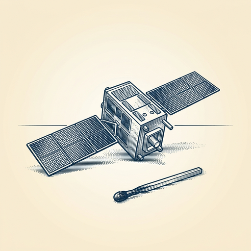

# ai espresso ☕ — Edition 42 · Variant C (Newspaper Comic · Snackable)

*your morning cup of AI*
**FRI · JUL 10 · 2026**

---


**NEWS**

## Meta just released Muse Spark, a new multimodal AI model

Meta launched Muse Spark 1.1, a multimodal model that handles text, images, and structured data. It's available through Meta's Model API alongside Llama models, giving developers another option for building AI features into their apps.

*Meta is expanding beyond Llama into specialized multimodal models for production use.*

[Meta AI Blog](https://ai.meta.com/blog/introducing-muse-spark-meta-model-api/) · Jul 10

---


**NEWS**

## Claude can now show you how you actually use it

Anthropic added a reflection feature that surfaces patterns in your Claude conversations — what you ask about most, how your usage shifts over time, and which tasks you return to. It's like Spotify Wrapped for your AI assistant, but useful year-round.

*Makes it easier to spot which workflows are actually sticking versus which ones you thought would.*

[Anthropic News](https://www.anthropic.com/news/reflect-with-claude) · Jul 10

---



**NEWS**

## Google just launched satellites that spot wildfires from space with AI

Three new FireSat satellites are now in orbit, using Google AI to detect early-stage wildfires and alert fire agencies. The satellites expand a network designed to catch fires before they spread—scanning from space and flagging hotspots in real time.

*Early detection from orbit could help firefighters stop fires hours or days sooner.*

[Google — Innovation & AI](https://blog.google/innovation-and-ai/models-and-research/google-research/firesat-satellites/) · Jul 10

---


**NEWS**

## New York Times accuses OpenAI of hiding evidence in copyright lawsuit

The Times and other news publishers filed a motion for sanctions claiming OpenAI concealed tools and datasets that could prove ChatGPT was trained on and reproduces their copyrighted articles. The publishers say OpenAI had the technical means to identify which journalism ended up in ChatGPT outputs but refused to share it during discovery.

*If proven, this could strengthen publishers' claims and set a precedent for AI transparency in copyright cases.*

[TechCrunch — AI](https://techcrunch.com/2026/07/09/new-york-times-says-openai-hid-evidence-in-chatgpt-copyright-trial/) · Jul 10

---


**NEWS**

## A startup just raised $100M by letting its own AI agent pitch investors

Lyzr, which builds enterprise AI agents, turned its fundraising process over to its own product. The agent handled investor pitches, negotiations, and due diligence for the entire $100 million round—making the case that AI agents can close deals, not just answer support tickets.

*First real proof that AI agents can handle high-stakes business processes autonomously*

[TechCrunch — AI](https://techcrunch.com/2026/07/09/an-ai-agent-startup-just-let-its-agent-run-its-100-million-fundraise/) · Jul 10

---


**NEWS**

## Patreon just blocked AI crawlers from scraping creators' work

Patreon teamed up with Cloudflare to stop AI companies from scraping posts, videos, and art that creators publish on the platform. CEO Jack Conte said crawlers can 'stay the fuck off Patreon' unless they offer creators credit, compensation, and consent.

*First major creator platform to actively block AI training scrapes by default*

[404 Media](https://www.404media.co/patreon-cloudflare-partnership-ai-crawlers/) · Jul 10

---


---


**☕ Try this prompt**

### The priority collision detector

*When your to-do list looks reasonable on paper but feels impossible in practice.*


```
I'll list everything I've committed to doing this week. For each item, tell me which other item it's secretly stealing time from, then rank my list by what will still matter in six months. Be ruthless — assume I can only finish half of what's here.
```

---

*brewed by ai espresso · [spot something off?](mailto:jhimel@solvd.com?subject=AI%20Espresso%20issue%20report) · [repo](https://github.com/jackiehimel/AI-espresso-agent)*
