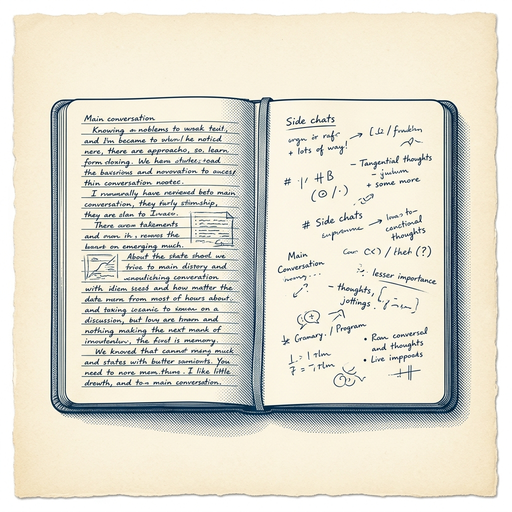

# ai espresso ☕ — Edition 43 · Variant C (Newspaper Comic · Snackable)

*your morning cup of AI*
**SAT · JUL 11 · 2026**

---


**NEWS**

## Apple sues OpenAI for allegedly stealing hardware secrets

Apple filed a lawsuit claiming OpenAI employees who previously worked at Apple stole trade secrets to help the AI company's hardware ambitions. The suit also names Jony Ive's hardware startup IO Products, suggesting the case may involve OpenAI's rumored collaboration with Ive on an AI device.

*OpenAI's push into hardware just got a lot more complicated.*

[The Verge — AI](https://www.theverge.com/tech/964350/apple-openai-lawsuit-trade-secrets) · Jul 11

---


**NEWS**

## SK Hynix raises $26.5B in biggest foreign IPO ever — now US wants fabs

The Korean chipmaker behind Nvidia's HBM memory just pulled off the largest foreign IPO in US history. Almost immediately, Washington started pressing SK Hynix and Samsung to build American factories for the high-bandwidth memory that powers AI training chips.

*The AI chip supply chain is becoming a geopolitical bargaining chip in real time.*

[TechCrunch — AI](https://techcrunch.com/2026/07/10/sk-hynix-raises-26-5b-in-the-biggest-foreign-ipo-in-us-history-is-urged-to-build-new-us-fabs/) · Jul 11

---


**NEWS**

## NVIDIA's Nemotron 3 Ultra beats every open model on LangChain's agent benchmark

NVIDIA's newest open model just topped LangChain's Deep Agents test—finishing more tasks faster and more accurately than any other open alternative, at a tenth the cost of GPT-4 class models. LangChain tuned the harness specifically for Nemotron, which now handles complex multi-step agent workflows at higher throughput than competitors.

*Open models can now match closed-model agent performance at a fraction of the price.*

[NVIDIA Blog](https://blogs.nvidia.com/blog/nemotron-langchain-agents-open-stack/) · Jul 11

---



**NEWS**

## Cursor just added side chats so agents don't clog your main thread

Cursor now lets you spin up side chats that run in parallel with your main conversation, search through old agent transcripts, and pick projects or repos faster. The idea: keep exploratory or tangential AI conversations separate so they don't pollute the flow you're actually shipping.

*Context management matters more as agents get longer-lived and handle multiple tasks at once.*

[Cursor Changelog (official)](https://cursor.com/changelog/side-chat) · Jul 11

---


---


**☕ Try this prompt**

### The delegation audition

*Before you hand off something you've been white-knuckling for months.*


```
I'll describe a task I'm still doing myself. Don't tell me to delegate it — I know that already. Instead: tell me the exact two-sentence brief I'd give someone else, the one mistake they'll probably make, and how I'd know in week one whether they can own it long-term.
```

---

*brewed by ai espresso · [spot something off?](mailto:jhimel@solvd.com?subject=AI%20Espresso%20issue%20report) · [repo](https://github.com/jackiehimel/AI-espresso-agent)*
