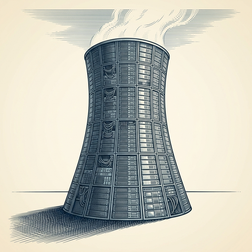

# ai espresso ☕ — Edition 44 · Variant C (Newspaper Comic · Snackable)

*your morning cup of AI*
**MON · JUL 13 · 2026**

---


**NEWS**

## OpenAI's head of safety is leaving the company

Johannes Heidecke is stepping down as OpenAI's head of safety systems just as the company merges its research and safety teams. The move continues a pattern of safety-focused leaders departing OpenAI over the past year, including co-founder Ilya Sutskever and researchers who left to start rival labs focused on AI safety.

*Another senior safety voice exits as OpenAI races to ship products faster*

[Wired — AI](https://www.wired.com/story/openai-head-of-safety-leaving/) · Jul 13

---


**NEWS**

## Meta kills Instagram feature that let anyone make AI deepfakes of you

Meta pulled its new AI image tool after backlash erupted over letting users generate AI images of any public Instagram account just by tagging them. The feature went live this week with no opt-out for account owners, meaning anyone could feed your photos into Meta's image generator without permission.

*Even Meta decided this crossed a line—consent still matters for training data.*

[The Verge — AI](https://www.theverge.com/tech/964416/meta-instagram-ai-muse-image-deepfakes) · Jul 13

---


**NEWS**

## Waze now lets you report hazards by talking to Gemini

Google integrated Gemini into Waze so you can report road issues conversationally instead of tapping through menus while driving. Just say what you see—"there's a pothole in the left lane"—and Gemini will file it. The update also brings natural-language navigation like "avoid highways" without hunting for settings.

*Voice UI that understands context makes safety features actually usable while driving.*

[The Verge — AI](https://www.theverge.com/transportation/964132/waze-gemini-ai-voice-commands-less-chatty) · Jul 13

---


**NEWS**

## DoorDash, Siemens, and Airbnb are switching to Chinese AI models

Major companies are adopting models from DeepSeek and Alibaba to cut AI costs and reduce dependence on OpenAI and Anthropic. DoorDash uses DeepSeek for customer service routing, while Siemens and Airbnb are testing Chinese models for various internal tasks. The shift comes as US model prices remain high despite recent cuts.

*Chinese AI models are now cheap and good enough to poach enterprise customers from OpenAI.*

[FT — Technology](https://www.ft.com/content/9c8ff45b-7c20-4c2e-93c9-c52339ffdcee) · Jul 13

---


**NEWS**

## Intel puts $5.7 billion into its Ireland plant to chase AI chip leaders

Intel is spending €5 billion to expand its Irish manufacturing facility as it tries to catch up in AI chip production. The move signals Intel's push to reclaim manufacturing leadership after falling behind rivals like TSMC and Nvidia in the race to produce cutting-edge AI processors.

*Intel is betting billions it can still compete in AI hardware after years of losing ground.*

[Bloomberg Technology](https://www.bloomberg.com/news/articles/2026-07-13/intel-invests-5-billion-in-irish-hub-to-keep-up-in-ai-chip-race) · Jul 13

---



**NEWS**

## Meta commits $50 billion to a single Louisiana data center for AI

Meta announced its Hyperion data center in Louisiana will cost over $50 billion and consume 5 gigawatts of power—enough to run a small city. The facility, enabled by state tax incentives, represents one of the largest single infrastructure investments in AI computing.

*Big Tech is betting billions on physical infrastructure to keep pace with AI demand.*

[CNBC — Technology](https://www.cnbc.com/2026/07/13/meta-louisiana-data-center-investment-reaches-50-billion-amid-ai-push.html) · Jul 13

---


---


**☕ Try this prompt**

### The research rabbit hole escape

*When you have 47 tabs open and forgot what you were looking for.*


```
I'm researching a topic and I've collected way too much information. I'll describe what I'm trying to figure out below. Give me: the one question that actually matters, three sources that would answer it, and permission to ignore everything else I've bookmarked.
```

---

*brewed by ai espresso · [spot something off?](mailto:jhimel@solvd.com?subject=AI%20Espresso%20issue%20report) · [repo](https://github.com/jackiehimel/AI-espresso-agent)*
