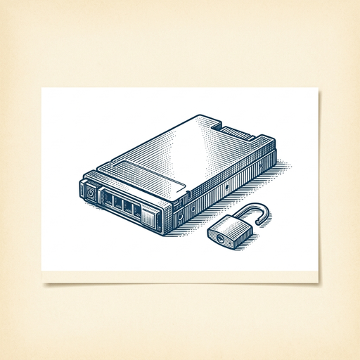
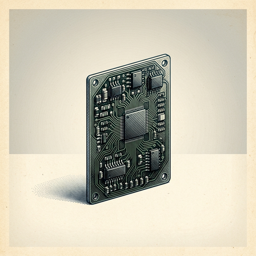

# ai espresso ☕ — Edition 47 · Variant C (Newspaper Comic · Snackable)

*your morning cup of AI*
**THU · JUL 16 · 2026**

---


**NEWS**

## EU forces Google to open Android and Search data to rival AI assistants

Europe's antitrust regulators ordered Google to give competing AI assistants and search engines deeper access to Android's core features and Google Search data. The ruling aims to break Google's control over mobile and search platforms, potentially letting rivals like ChatGPT or Perplexity tap into user data and system hooks Google has kept to itself.

*Could reshape how AI assistants compete on the world's dominant mobile OS.*

[The Verge — AI](https://www.theverge.com/policy/966438/eu-google-android-ai-interoperability-search-data-dma) · Jul 16

---



**NEWS**

## Thinking Machines just open-sourced its first AI model after 18 months in stealth

The startup released Inkling, an open model designed to challenge the idea that one giant AI can handle everything. After spending a year and a half building custom AI infrastructure away from the spotlight, this is their first public release—and a bet that specialized models beat general-purpose ones for real work.

*More proof the industry is splitting between massive general models and task-specific alternatives.*

[TechCrunch — AI](https://techcrunch.com/2026/07/15/thinking-machines-amps-up-its-bet-against-one-size-fits-all-ai-with-its-first-open-model-inkling/) · Jul 16

---


**NEWS**

## Japan is buying 27,500 Nvidia chips to build a national robotics AI

Japan plans to purchase Nvidia's next-generation Rubin chips to create its own foundational AI model specifically designed for robots. The 27,500-chip order represents a sovereign AI push focused on robotics rather than general-purpose models.

*Countries are now building national AI infrastructure for specific industries, not just chatbots.*

[Bloomberg Technology](https://www.bloomberg.com/news/articles/2026-07-16/japan-to-buy-nvidia-rubin-chips-to-build-sovereign-ai-for-robots) · Jul 16

---



**NEWS**

## Nvidia ships two new modules to run AI agents on robots and edge devices

The T3000 and T2000 modules are compact computers built on Nvidia's Thor architecture, designed to run foundation models directly on robots and edge machines without cloud connectivity. They're aimed at manufacturers moving from prototypes to mass production of autonomous systems that need to process AI locally.

*Foundation models are moving from the cloud to devices that operate in the physical world.*

[NVIDIA Blog](https://blogs.nvidia.com/blog/jetson-thor-robotics-edge-ai-agent/) · Jul 16

---


---


**☕ Try this prompt**

### The meeting cost calculator

*Before you send that calendar invite to twelve people.*


```
I'm about to schedule a recurring meeting. Tell me the annual cost in person-hours if it runs for a year, then show me three cheaper ways to get the same outcome. Finally, write the one-sentence purpose statement this meeting would need to justify its existence.
```

---

*brewed by ai espresso · [spot something off?](mailto:jhimel@solvd.com?subject=AI%20Espresso%20issue%20report) · [repo](https://github.com/jackiehimel/AI-espresso-agent)*
