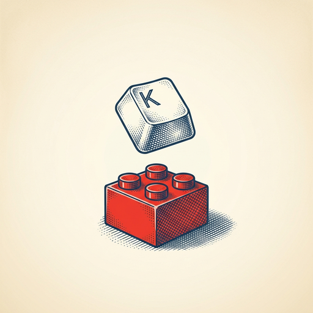

# ai espresso ☕ — Edition 48 · Variant C (Newspaper Comic · Snackable)

*your morning cup of AI*
**FRI · JUL 17 · 2026**

---


**NEWS**

## China's Kimi K3 just became the cheapest frontier AI model

Moonshot AI's new Kimi K3 model matches GPT-4o and Claude 3.5 Sonnet on key benchmarks while costing a fraction of the price—roughly $0.14 per million input tokens versus $2.50-$3 for Western alternatives. The model also handles 128K context windows and can process images, making it a serious budget option for developers willing to work with a Chinese provider.

*Frontier performance at one-tenth the API cost changes the economics of AI deployment*

[Platformer (Casey Newton)](https://www.platformer.news/kimi-k3-launch-moonshot-ai-china/) · Jul 17

---


**NEWS**

## Claude can now pull your passwords from 1Password

1Password's new browser integration lets you authorize Claude to grab your login credentials and use them to complete tasks like booking flights or managing accounts. You approve access per-task instead of manually copying passwords into the chatbot.

*AI agents just got closer to actually handling your errands instead of just drafting the emails.*

[The Verge — AI](https://www.theverge.com/tech/966442/1password-anthropic-claude-browser-integration) · Jul 17

---


**NEWS**

## Google Vids now lets you generate and star in videos with AI avatars

Google Vids added two features: Gemini Omni generates full videos from text prompts (script, visuals, voiceover), and Personal Avatars let you create a digital version of yourself that speaks your script without recording each time. Both ship to Workspace users starting this week.

*You can now ship explainer videos or training content without filming or hiring talent.*

[Google AI Blog](https://blog.google/products-and-platforms/products/workspace/gemini-omni-personal-avatars/) · Jul 17

---



**NEWS**

## Roblox now lets you build a game from a single text prompt

Roblox just added a 'Build' feature to its mobile app that generates playable games from a text description. Type what you want, and the AI creates a basic game you can jump into and customize.

*Game creation just went from scripting to typing—no code, no desktop required.*

[TechCrunch — AI](https://techcrunch.com/2026/07/16/roblox-launches-an-ai-powered-game-creation-feature-in-its-mobile-app/) · Jul 17

---


---


**☕ Try this prompt**

### The skill gap translator

*When you're tired of bookmarking tutorials you'll never finish.*


```
I want to learn something new and I'll describe it below. Don't give me a course list. Instead: tell me the three sub-skills that actually matter, which one I should ignore completely, and the smallest project that would force me to learn all three at once.
```

---

*brewed by ai espresso · [spot something off?](mailto:jhimel@solvd.com?subject=AI%20Espresso%20issue%20report) · [repo](https://github.com/jackiehimel/AI-espresso-agent)*
