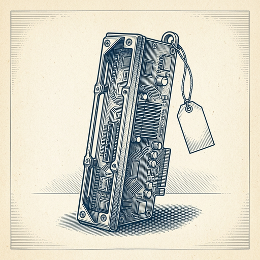
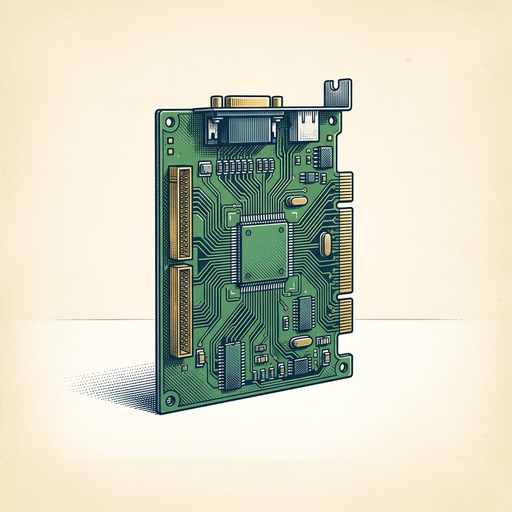

# ai espresso ☕ — Edition 49 · Variant C (Newspaper Comic · Snackable)

*your morning cup of AI*
**SAT · JUL 18 · 2026**

---


**NEWS**

## Chinese startup Moonshot claims its new AI model matches GPT-4 and Claude

Moonshot AI released a model it says performs as well as top-tier systems from OpenAI and Anthropic. The announcement spooked markets and signals China's AI labs are catching up to U.S. rivals despite export restrictions on advanced chips.

*The gap between Chinese and American frontier models may be shrinking faster than expected.*

[Bloomberg Technology](https://www.bloomberg.com/news/articles/2026-07-17/china-s-powerful-new-moonshot-ai-model-closes-gap-with-us-rivals) · Jul 18

---



**NEWS**

## Meta is negotiating to rent Anthropic $10 billion worth of GPU clusters

Meta is in talks to lease computing infrastructure to Anthropic in what could become a $10 billion deal. The arrangement would let Anthropic run Claude on Meta's data centers while creating a new revenue stream for Meta's massive AI hardware investments.

*Big Tech's GPU hoards are becoming a product you can rent, not just an internal advantage.*

[NYT — Technology](https://www.nytimes.com/2026/07/17/technology/meta-anthropic-ai-computing-power.html) · Jul 18

---



**NEWS**

## NVIDIA's new AI chip cuts the cost of training agents by half

NVIDIA's Vera Rubin chip is built specifically for post-training—the phase where AI agents learn from feedback and real-world tasks. The company says extreme hardware-software co-design delivers the lowest cost per token for this workload, which matters more as companies shift from pre-training foundation models to fine-tuning agents that can actually do things.

*Training agents costs less, so more companies can build custom AI that acts instead of just answering questions.*

[NVIDIA Blog](https://blogs.nvidia.com/blog/nvidia-vera-rubin-post-training-intelligence-per-dollar/) · Jul 18

---


**NEWS**

## White House is now deciding who gets access to frontier AI models

The Trump administration is stepping in to control access to the most advanced AI systems from OpenAI, Anthropic, and others, according to sources familiar with the matter. The move shifts power over frontier model distribution from the companies that build them to federal officials.

*Government control over AI access could reshape who builds with cutting-edge models and how fast AI capabilities spread.*

[CNBC — Technology](https://www.cnbc.com/2026/07/17/white-house-ai-access-anthropic-openai.html) · Jul 18

---


**NEWS**

## SpaceX is negotiating a multi-billion-dollar AI data center deal with the Pentagon

Elon Musk's SpaceX is in talks to supply billions of dollars' worth of computing infrastructure to power the Pentagon's AI initiatives. The arrangement would make SpaceX a major provider of data-center capacity for defense AI workloads.

*The company best known for rockets is now competing to run military AI compute at scale.*

[WSJ — Tech](https://www.wsj.com/tech/ai/spacex-in-talks-to-provide-computing-power-for-pentagons-ai-push-15e752e4?mod=rss_Technology) · Jul 18

---


**NEWS**

## TikTok is testing a tool that lets creators flag AI copies of themselves

TikTok is piloting an opt-in feature with some US creators that scans videos for AI-generated likenesses and lets people report deepfakes of themselves to the company. YouTube has been working on similar tech, but TikTok's version is now live in limited testing.

*Creators can finally push back when AI clones their face or voice without permission.*

[The Verge — AI](https://www.theverge.com/tech/967486/tiktok-ai-likeness-detection-tool) · Jul 18

---


---


**☕ Try this prompt**

### The strategy stress test

*Before you commit the next quarter's budget to a plan that hasn't been properly challenged.*


```
I'll describe our current strategy below. Attack it like a competitor who wants to destroy us. Tell me: the one assumption we're making that's probably wrong, the move we're most vulnerable to, and the pivot we should have ready if things shift in the next six months.
```

---

*brewed by ai espresso · [spot something off?](mailto:jhimel@solvd.com?subject=AI%20Espresso%20issue%20report) · [repo](https://github.com/jackiehimel/AI-espresso-agent)*
