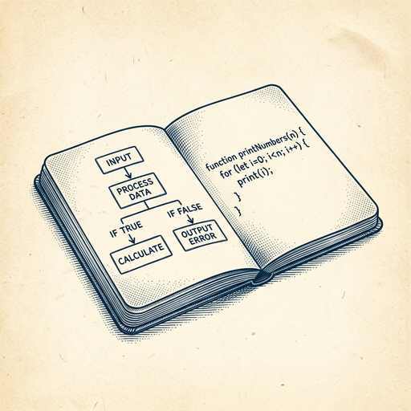

# ai espresso ☕ — Edition 50 · Variant C (Newspaper Comic · Snackable)

*your morning cup of AI*
**SUN · JUL 19 · 2026**

---


**NEWS**

## Alibaba's Qwen3.8 Max claims to rival top AI models

Alibaba released a preview of Qwen3.8 Max, positioning it as competitive with frontier models and second only to Anthropic's Fable 5. The model enters an increasingly crowded field of companies claiming near-parity with leading AI systems.

*China's top tech companies are closing the gap with Western AI labs faster than expected.*

[Bloomberg Technology](https://www.bloomberg.com/news/articles/2026-07-19/alibaba-s-qwen-unveils-preview-of-flagship-ai-model) · Jul 19

---


**NEWS**

## Claude Code just switched from Node to Bun (written in Rust)

Anthropic quietly moved Claude Code's runtime from Node.js to Bun, a JavaScript runtime built in Rust that's known for faster startup and execution. The change means Claude Code agents now spin up quicker and run more efficiently when they're writing and testing code for you.

*Faster runtimes mean agents can iterate on code in less time — and waste fewer tokens waiting.*

[Hacker News (front page)](https://simonwillison.net/2026/Jul/19/claude-code-in-bun-in-rust/) · Jul 19

---



**NEWS**

## Cursor's Slack bot now works across repos and shares its plan first

Cursor in Slack got three upgrades: it tells you what it's about to do before starting, works in codebases with multiple repos, and can follow conversations across different channels and threads. No more guessing what the bot will change or switching contexts manually.

*Less friction between where you talk about code and where you actually write it.*

[Cursor Changelog (official)](https://cursor.com/changelog/slack-improvements) · Jul 19

---


**NEWS**

## Google renames NotebookLM to Gemini Notebook

Google's AI note-taking app is getting a rebrand. NotebookLM is now called Gemini Notebook, though it'll stay a standalone app even as Google weaves it tighter into Gemini and Search. The tool first launched as Project Tailwind in May 2023.

*Another Google product gets absorbed into the Gemini brand umbrella.*

[The Verge — AI](https://www.theverge.com/tech/966112/google-gemini-notebook-notebooklm) · Jul 19

---


---


**☕ Try this prompt**

### The priorities lie detector

*When your to-do list and your stated priorities haven't met in months.*


```
I'll tell you my top three priorities for this quarter. For each one, tell me what I'd have to stop doing this week to prove I actually mean it. Then rank them by which one I'm most likely lying to myself about.
```

---

*brewed by ai espresso · [spot something off?](mailto:jhimel@solvd.com?subject=AI%20Espresso%20issue%20report) · [repo](https://github.com/jackiehimel/AI-espresso-agent)*
