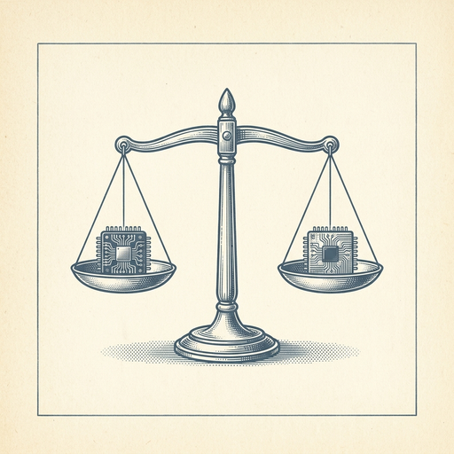
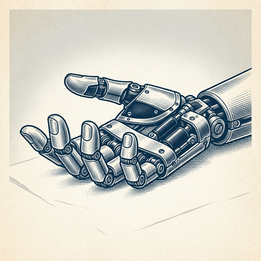
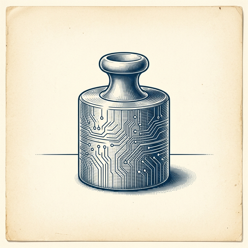

# ai espresso ☕ — Edition 51 · Variant C (Newspaper Comic · Snackable)

*your morning cup of AI*
**MON · JUL 20 · 2026**

---



**NEWS**

## Two Chinese AI labs just shipped models that rival GPT-4o and Claude at a fraction of the cost

Moonshot and Alibaba both released new models this week claiming performance on par with OpenAI's and Anthropic's flagship products—but cheaper to run. Moonshot's Kimi k3 and Alibaba's Qwen are both open-source, adding pressure to the idea that the U.S. still holds a meaningful lead at the AI frontier.

*The gap between Chinese and American frontier models is closing faster than expected.*

[The Verge — AI](https://www.theverge.com/ai-artificial-intelligence/967781/chinese-ai-models-open-source-moonshot-kimi-k3-alibaba-qwen) · Jul 20

---



**NEWS**

## Xiaomi just open-sourced the model behind its humanoid robot

Xiaomi released Robotics-1, a 7B-parameter vision-language-action model that powers its CyberOne humanoid robot. The model processes camera feeds and generates robot actions in real time. Code, weights, and training data are all public—anyone can now build on the same foundation Xiaomi uses for its physical robots.

*A consumer electronics giant just made state-of-the-art robotics AI free to use and modify.*

[Hacker News (front page)](https://robotics.xiaomi.com/xiaomi-robotics-1.html) · Jul 20

---


**NEWS**

## Bristol Myers Squibb is building a second massive AI cluster for drug discovery

The pharma giant already runs one of the largest AI systems in life sciences and is now deploying a second NVIDIA DGX SuperPOD—this one built on the new Vera Rubin platform. BMS internally calls it the "SuperDuperPOD" and says the first cluster already delivered serious results in drug development.

*Big Pharma is betting billions that AI can find drugs faster than traditional methods.*

[NVIDIA Blog](https://blogs.nvidia.com/blog/bristol-myers-squibb-building-life-science-industrys-most-advanced-ai-factory-on-nvidia-vera-rubin/) · Jul 20

---



**NEWS**

## Databricks hits $188B valuation as companies bet big on open-weight AI

The data platform company, once known mainly for analytics, has repositioned itself as an AI infrastructure player. Its new valuation comes as it publishes research showing open-weight models can cut coding costs compared to proprietary alternatives like GPT-4.

*Open-weight models are now competing on cost at enterprise scale, not just on principle.*

[TechCrunch — AI](https://techcrunch.com/2026/07/17/databricks-hits-188b-valuation-extending-its-run-as-ais-favorite-second-act/) · Jul 20

---


---


**☕ Try this prompt**

### The competitor playbook

*Before you lock in your roadmap, see it through hostile eyes.*


```
I'm going to describe my product or project below. Pretend you're my smartest competitor who just learned everything about what I'm building. Write their internal strategy memo: the obvious move they'd copy, the weakness they'd exploit, and the one thing they'd do differently that would actually win.
```

---

*brewed by ai espresso · [spot something off?](mailto:jhimel@solvd.com?subject=AI%20Espresso%20issue%20report) · [repo](https://github.com/jackiehimel/AI-espresso-agent)*
