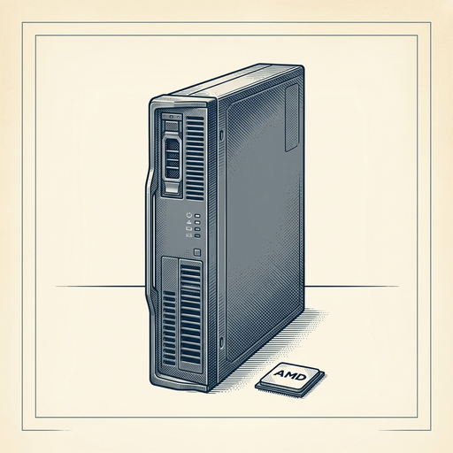
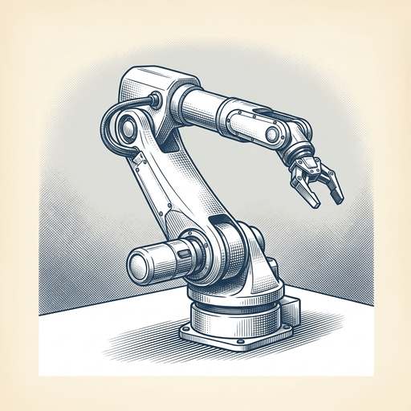

# ai espresso ☕ — Edition 52 · Variant C (Newspaper Comic · Snackable)

*your morning cup of AI*
**TUE · JUL 21 · 2026**

---


**NEWS**

## Anthropic's $1.5B copyright settlement just got approved

A federal judge approved Anthropic's settlement with publishers and authors who sued over AI training data. The deal sets a precedent for how much using copyrighted content without permission might cost, but it doesn't answer whether training on copyrighted work is legal in the first place.

*Every AI company training on web data now has a price tag to reference*

[TechCrunch — AI](https://techcrunch.com/2026/07/20/anthropics-landmark-1-5b-copyright-settlement-is-approved/) · Jul 21

---



**NEWS**

## AMD just sold Microsoft its first full AI rack system

AMD launched Helios, a complete rack-scale AI system that competes directly with Nvidia's DGX boxes. Microsoft is the first announced buyer, joining Meta, OpenAI, and Oracle as customers buying AMD's full hardware stack instead of just chips.

*AMD is moving from selling GPUs to selling turnkey AI infrastructure—competing where Nvidia makes the most margin.*

[CNBC — Technology](https://www.cnbc.com/2026/07/20/amd-helios-microsoft-ai-nvidia.html) · Jul 21

---



**NEWS**

## Samsung just launched a robotics division with a humanoid bot

Samsung created a new robotics unit called RX, and its first product appears to be a humanoid robot. The move puts Samsung in direct competition with Tesla, Boston Dynamics, and Figure as tech giants race to build general-purpose robots that can work in homes and factories.

*Another tech giant is betting billions that humanoid robots will be the next computing platform.*

[Engadget — AI](https://www.engadget.com/2219517/samsung-establishes-its-own-robotics-division/) · Jul 21

---


**NEWS**

## AI is now finding counterexamples faster than human mathematicians

Mathematicians are running into a new problem: AI systems are beating them to counterexamples that disprove conjectures. The Xena Project reports that automated theorem provers are now routinely discovering edge cases and contradictions before human researchers can work through the proofs manually.

*Math research is becoming a race between human intuition and machine search speed*

[Hacker News (front page)](https://xenaproject.wordpress.com/2026/07/20/human-mathematicians-are-being-outcounterexampled/) · Jul 21

---


---


**☕ Try this prompt**

### The procrastination debugger

*When you know what to do but keep finding reasons not to start.*


```
I've been avoiding something for weeks and I'll describe it below. Don't tell me to break it into steps or use a timer. Instead: diagnose the real reason I'm stalling, tell me what fear or assumption is driving it, and give me the smallest possible action that would prove that assumption wrong today.
```

---

*brewed by ai espresso · [spot something off?](mailto:jhimel@solvd.com?subject=AI%20Espresso%20issue%20report) · [repo](https://github.com/jackiehimel/AI-espresso-agent)*
