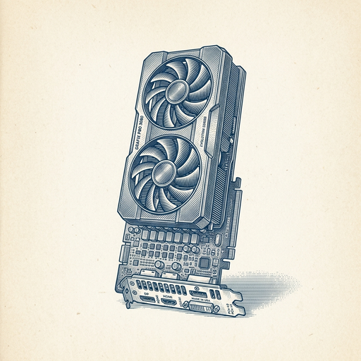
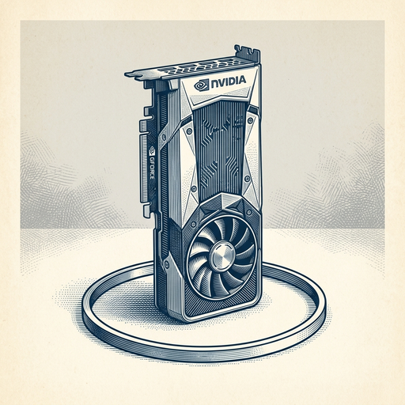
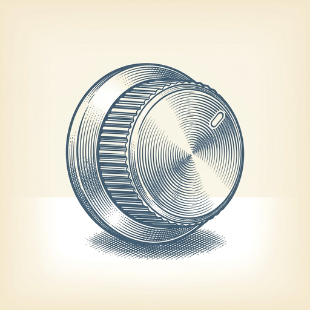

# ai espresso ☕ — Edition 55 · Variant C (Newspaper Comic · Snackable)

*your morning cup of AI*
**MON · JUL 27 · 2026**

---



**NEWS**

## Nvidia backs Ilya Sutskever's new AI lab with compute credits

The chip giant is providing cloud computing resources to Safe Superintelligence, the AI safety startup founded by OpenAI's former chief scientist. The partnership gives Nvidia another marquee customer as hyperscalers like Microsoft and Meta build their own AI infrastructure.

*Nvidia is courting high-profile AI labs to stay essential as Big Tech moves toward self-sufficiency in chips.*

[WSJ — Tech](https://www.wsj.com/tech/ai/nvidia-bets-on-ilya-sutskevers-new-ai-lab-to-expand-compute-reach-f95596e8?mod=rss_Technology) · Jul 27

---



**NEWS**

## Nvidia is closing $750B in AI deals that may be inflating its own demand

Nvidia is working on AI infrastructure deals worth over $750 billion—investments that critics say artificially boost demand for Nvidia's own chips. The concern: if Nvidia-backed companies are buying Nvidia hardware with Nvidia's money, the sales numbers may not reflect real market demand.

*If AI demand is circular—funded by the same companies selling the hardware—the bubble risks are higher than they appear.*

[Bloomberg Technology](https://www.bloomberg.com/news/articles/2026-07-27/nvidia-s-750-billion-deals-revive-fear-of-ai-circular-financing) · Jul 27

---


**NEWS**

## Midjourney just bought the astrology app Co-Star

The AI image generator announced it acquired Co-Star, a free app that delivers personalized daily horoscopes. Midjourney has expanded from generating AI cat pictures to full-body ultrasound scans, and now it's adding astrology readings to its portfolio.

*An AI company known for images is betting on personality-driven content beyond visuals.*

[The Verge — AI](https://www.theverge.com/ai-artificial-intelligence/970894/midjourney-co-star-acquisition) · Jul 27

---



**NEWS**

## Enigma raises $70M to make robot control as simple as a volume knob

The startup just closed a massive seed round led by Index Ventures and Ribbit Capital to build interfaces that let anyone control robots without coding or complex menus. Think physical dials and sliders instead of software dashboards.

*If robots become as easy to operate as appliances, they can finally leave the factory floor.*

[TechCrunch — AI](https://techcrunch.com/2026/07/27/enigma-raises-70m-to-make-controlling-a-robot-as-easy-as-adjusting-the-volume/) · Jul 27

---


---


**☕ Try this prompt**

### The meeting you shouldn't attend

*Before you spend an hour in a room wondering why you're there.*


```
I'll describe a meeting on my calendar below. Don't tell me how to make it better. Instead: tell me the exact outcome I need from it, who could get that outcome without me there, and the two-sentence message I should send declining while keeping everyone happy.
```

---

*brewed by ai espresso · [spot something off?](mailto:jhimel@solvd.com?subject=AI%20Espresso%20issue%20report) · [repo](https://github.com/jackiehimel/AI-espresso-agent)*
