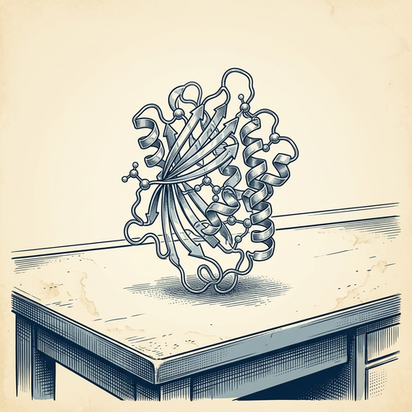

# ai espresso ☕ — Edition 56 · Variant C (Newspaper Comic · Snackable)

*your morning cup of AI*
**WED · JUL 29 · 2026**

---


**NEWS**

## Google's Gemini API now runs agents that watch your app and trigger themselves

Google added hooks to its Managed Agents API so developers can wire agents directly into their apps — agents can now trigger on events like new user signups or form submissions, run background tasks, and call your own functions. The API also got Gemini 3.6 Flash, which Google says is faster and cheaper than 2.0 Flash.

*Agents that respond to real app events instead of just chat prompts are closer to useful automation.*

[Google AI Blog](https://blog.google/innovation-and-ai/technology/developers-tools/expanding-managed-agents-gemini-api-3-6-flash-hooks/) · Jul 29

---


**NEWS**

## Perplexity's AI agent can now control your Windows PC

Perplexity just brought its Personal Computer tool to Windows, letting the AI access your local files and apps to work as a digital assistant. It runs locally on your machine, doing tasks across your computer like the Mac version launched in April.

*AI agents are moving from cloud services to tools that actually control your desktop computer.*

[The Verge — AI](https://www.theverge.com/ai-artificial-intelligence/971750/perplexity-personal-computer-windows-ai-agents) · Jul 29

---



**NEWS**

## Google shuts down Nobel-winning AlphaFold team to focus on Gemini

DeepMind is disbanding the AlphaFold team that won the 2024 Nobel Prize in Chemistry for predicting protein structures. The team's work helped scientists understand how proteins fold, accelerating drug discovery and biological research. Google is redirecting resources toward its Gemini AI models instead.

*A Nobel-winning research breakthrough gets shelved for chatbot economics.*

[Engadget — AI](https://www.engadget.com/2225849/google-shuts-down-alphafold/) · Jul 29

---


**NEWS**

## Anthropic says it won't release open-weight frontier models

Anthropic published its first official stance on open-weights AI: it will keep releasing limited versions of older models (like the Haiku family), but won't open-weight anything at the frontier. The company argues catastrophic risks currently outweigh the benefits of fully open releases for cutting-edge systems.

*The lab behind Claude just drew a public line on what it will and won't share with the research community.*

[Anthropic News](https://www.anthropic.com/news/position-open-weights-models) · Jul 29

---


**NEWS**

## Claude found new cracks in weakened encryption algorithms

Anthropic's Claude Mythos Preview discovered previously unknown attacks against weakened versions of cryptographic algorithms that secure online transactions and private messages. The model identified flaws during red-team testing of deliberately hobbled encryption standards.

*AI can now assist security researchers in finding vulnerabilities faster than manual audits.*

[NYT — Technology](https://www.nytimes.com/2026/07/28/us/politics/anthropic-ai-encryption-security-aes.html) · Jul 29

---


**NEWS**

## China's Moonshot AI hits $35B valuation after Kimi K3 rattles Silicon Valley

Moonshot AI just closed $3.5 billion in funding—more than expected—hitting a $35 billion valuation. The Chinese startup's Kimi K3 model recently sent shockwaves through Silicon Valley, proving China can compete at the frontier of AI development.

*The gap between US and Chinese AI labs is narrowing faster than most expected.*

[Bloomberg Technology](https://www.bloomberg.com/news/articles/2026-07-29/china-s-moonshot-ai-passes-funding-goal-to-hit-35-billion-value) · Jul 29

---


---


**☕ Try this prompt**

### The learning receipt

*Turn passive learning into actual behavior change before the insights evaporate.*


```
I just finished reading something or sat through a workshop. Before I forget it all, help me write three sentences: the one idea that changes how I'll work tomorrow, the concept I'm still confused about, and the person I should share this with and why.
```

---

*brewed by ai espresso · [spot something off?](mailto:jhimel@solvd.com?subject=AI%20Espresso%20issue%20report) · [repo](https://github.com/jackiehimel/AI-espresso-agent)*
