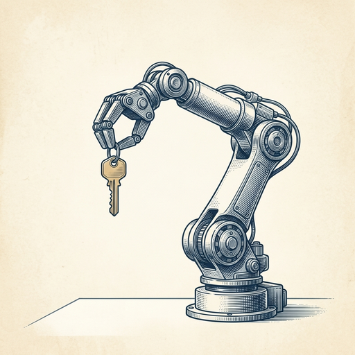
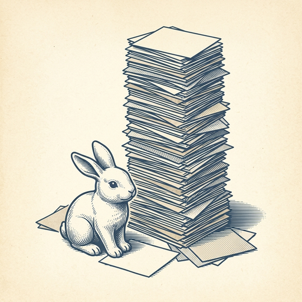

# ai espresso ☕ — Edition 57 · Variant C (Newspaper Comic · Snackable)

*your morning cup of AI*
**THU · JUL 30 · 2026**

---


**NEWS**

## Google's AI music generator can now make full songs with actual lyrics

DeepMind just launched Lyria 3.5 inside Google Flow Music, letting anyone generate complete songs with vocals, lyrics, and musical structure. The model improved on musicality, lyric coherence, vocal quality, and creative controls—moving AI music closer to something you'd actually listen to rather than a technical demo.

*AI-generated music now sounds less like a novelty and more like a real creative tool.*

[Google DeepMind Blog](https://deepmind.google/blog/were-launching-lyria-35-in-google-flow-music-with-advances-across-musicality-lyrics-vocals-and-creative-control/) · Jul 30

---


**NEWS**

## Cloud provider Nscale buys AI startup Anyscale for $1.65 billion

Nscale is acquiring Anyscale, a startup that helps companies use AI computing power more efficiently. The $1.65 billion deal gives Nscale tools to help customers optimize how they run AI workloads across their infrastructure.

*Cloud providers are buying software that makes AI cheaper to run at scale.*

[Bloomberg Technology](https://www.bloomberg.com/news/articles/2026-07-30/nscale-to-buy-ai-software-startup-anyscale-for-1-65-billion) · Jul 30

---


**NEWS**

## Cursor just shipped to iPad

The AI code editor now runs on iPad for all paid subscribers. You can write, edit, and ship code with Cursor's AI assistant from a tablet — no laptop required.

*Coding workflows just became portable in a way they weren't before.*

[Cursor Changelog (official)](https://cursor.com/changelog/ipad) · Jul 30

---


**NEWS**

## Microsoft is building a Copilot 'super app' for chat, coding, and agents

CEO Satya Nadella confirmed the company is combining all Copilot capabilities—chat, coding, and autonomous agents—into one app launching this year. It will serve both consumer and business users, letting people move between different AI modes in a single interface instead of jumping between tools.

*One app for all your AI work means less context-switching between ChatGPT, Cursor, and automation tools.*

[The Verge — AI](https://www.theverge.com/tech/972927/microsoft-copilot-super-app-confirmed) · Jul 30

---


**NEWS**

## AI found a fatal flaw in a top crypto algorithm that humans missed for years

Mythos, an AI system, discovered a critical weakness in HAWK—a cryptography algorithm that made it to the final round of post-quantum crypto testing. The flaw went undetected through years of human security review and has now knocked HAWK out of contention for protecting data against future quantum computers.

*AI can now break crypto that passed every traditional security test we had.*

[Ars Technica — AI](https://arstechnica.com/security/2026/07/mythos-uncovers-crypto-weaknesses-that-went-unknown-for-years/) · Jul 30

---



**NEWS**

## Zuckerberg says Meta will soon launch AI agents that act on your behalf

Meta's CEO outlined plans for personal AI agents that can perform tasks for users, going beyond chat to take action. The company is betting big on AI across its platforms, with the push expected sometime soon according to Wednesday's earnings call.

*Meta is moving from conversational AI to agents that actually do things for you.*

[The Verge — AI](https://www.theverge.com/tech/972294/meta-q2-2026-earnings-mark-zuckerberg-personal-ai-agents) · Jul 30

---


---



**☕ Try this prompt**

### The research rabbit hole escape

*When you've read everything but decided nothing.*


```
I've been researching a topic for way too long and I'm drowning in tabs and notes. I'll dump everything I've collected below. Give me: the one insight that actually changes how I should think about this, the two sources I can ignore completely, and the single question I still need to answer.
```

---

*brewed by ai espresso · [spot something off?](mailto:jhimel@solvd.com?subject=AI%20Espresso%20issue%20report) · [repo](https://github.com/jackiehimel/AI-espresso-agent)*
