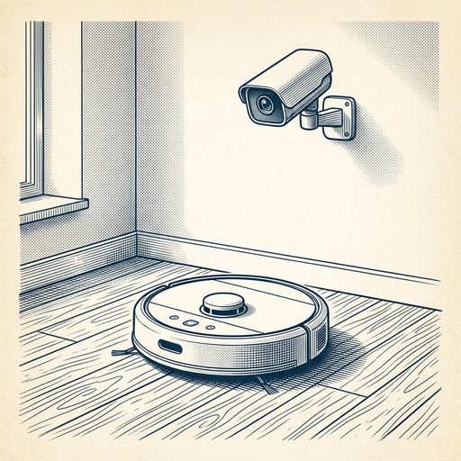
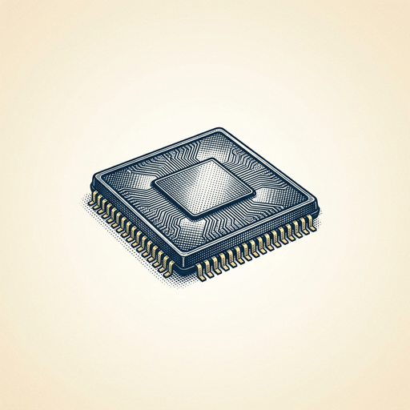

# ai espresso ☕ — Edition 58 · Variant C (Newspaper Comic · Snackable)

*your morning cup of AI*
**SUN · AUG 2 · 2026**

---


**NEWS**

## Anthropic tested Claude on three real hacks to see what it could do

Anthropic ran Claude through three actual cybersecurity incidents — a leaked API key, a compromised server, and a supply chain attack — to see if the model could investigate and respond like a security analyst. Claude handled basic triage but struggled with multi-step reasoning and deciding when to escalate. The company is publishing the eval framework so other teams can test their own models.

*First public benchmark using real incidents instead of synthetic CTF-style challenges.*

[Anthropic News](https://www.anthropic.com/news/investigating-incidents-cybersecurity-evals) · Aug 2

---



**NEWS**

## Google's new Gemini model can watch a room and tell robots what to do

Gemini Robotics ER 2 watches video feeds, figures out what needs doing, and coordinates multiple robots to handle tasks together. It can reason about real-world scenes and decide which robot should do what—like directing one bot to clean while another fetches supplies.

*Robots can now understand context from video and work together without pre-programmed choreography.*

[Google DeepMind Blog](https://deepmind.google/blog/gemini-robotics-er-2-powering-robotics-with-video-understanding-task-orchestration-and-multi-robot-collaboration/) · Aug 2

---


**NEWS**

## Apple is planning to charge power users for more AI

Tim Cook told investors Apple will offer 'upgrade possibilities on iCloud Plus' to let people use Apple Intelligence and the new Siri beyond whatever free limits exist. No pricing or timing yet, but Cook said he expects people will 'want to use it a lot.'

*Apple just confirmed it's building a paid tier for AI — following OpenAI and Anthropic's playbook.*

[The Verge — AI](https://www.theverge.com/tech/973552/apple-ceo-tim-cook-icloud-plus-ai) · Aug 2

---



**NEWS**

## Amazon's custom chip business just hit $25 billion a year

Amazon Web Services now pulls in over $25 billion annually from its custom-designed chips—Graviton for general computing and Trainium/Inferentia for AI workloads. That makes AWS one of the world's largest chip companies by revenue in just a decade, competing directly with Nvidia and Intel by offering cheaper, faster cloud instances to customers who train and run models.

*Cloud providers are now chip giants, which reshapes who controls AI infrastructure costs and performance.*

[Amazon News (About Amazon)](https://www.aboutamazon.com/news/aws/amazon-ai-chips-business-history?utm_source=rss) · Aug 2

---


---


**☕ Try this prompt**

### The strategy stress test

*Before you commit the budget and six months of roadmap to a single theory.*


```
I'll describe our current strategy below. Your job: find the assumption we're treating as fact. Then tell me what would have to be true for that assumption to break, and sketch the backup plan we'd need if it does. Be specific about timing.
```

---

*brewed by ai espresso · [spot something off?](mailto:jhimel@solvd.com?subject=AI%20Espresso%20issue%20report) · [repo](https://github.com/jackiehimel/AI-espresso-agent)*
