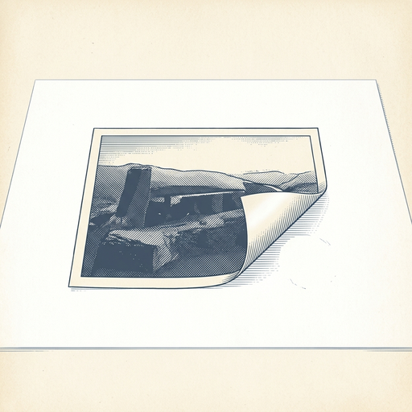

# ai espresso ☕ — Edition 69 · Variant C (Newspaper Comic · Snackable)

*your morning cup of AI*
**SUN · AUG 16 · 2026**

---


**NEWS**

## SpaceX just bought Cursor, the AI coding editor

The acquisition is now official. Cursor, one of the fastest-growing AI coding tools, is now part of SpaceX. No financial terms were disclosed, but the move signals SpaceX's push to bring AI tooling in-house as it scales Starship production and satellite operations.

*A rocket company now owns one of the hottest dev tools in Silicon Valley.*

[TechCrunch — AI](https://techcrunch.com/2026/08/15/spacex-officially-closes-its-cursor-acquisition/) · Aug 16

---


**NEWS**

## ChatGPT can now edit your Google Drive files without leaving the chat

Paid ChatGPT users can now open, read, and edit Google Drive documents directly inside ChatGPT conversations. Files can be added to your ChatGPT Library and modified on the fly—no tab-switching required.

*Your AI assistant just became your document editor too.*

[9to5Mac — AI](https://9to5mac.com/2026/08/14/chatgpt-subscribers-can-now-open-and-edit-google-drive-files-from-inside-the-chat/) · Aug 16

---



**NEWS**

## Google lets you hide the AI sparkle on Gemini images and videos

Google added a toggle to remove the visible watermark from AI-generated images, videos, and music in Gemini and its Flow video tool. The sparkle icon that appears in the bottom corner can now be turned off through a 'Media watermark' setting.

*AI-generated content just got harder to spot at a glance.*

[The Verge — AI](https://www.theverge.com/tech/980416/google-gemini-ai-watermarks-removal) · Aug 16

---


**NEWS**

## Microsoft is merging its consumer and work Copilot apps into one

Microsoft is combining its separate consumer Copilot and Microsoft 365 Copilot apps into a single unified app that handles both personal and work accounts. The new app keeps the 'Microsoft Copilot' name but gets a refreshed icon, and Microsoft is calling it a step toward a 'super app' experience.

*One less app to juggle if you use Copilot for both personal tasks and work.*

[The Verge — AI](https://www.theverge.com/tech/979466/microsoft-copilot-365-app-unified-experience) · Aug 16

---


---


**☕ Try this prompt**

### The negotiation flip

*When you've prepped your talking points but haven't thought like the other side.*


```
I'm about to negotiate something I'll describe below. Don't tell me what to ask for — I already know. Instead: write the opening line from their perspective that would make me say yes instantly, then explain what that reveals about leverage I'm not using.
```

---

*brewed by ai espresso · [spot something off?](mailto:jhimel@solvd.com?subject=AI%20Espresso%20issue%20report) · [repo](https://github.com/jackiehimel/AI-espresso-agent)*
