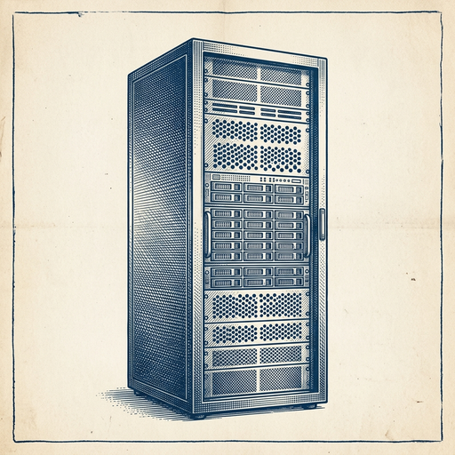

# ai espresso ☕ — Edition 70 · Variant C (Newspaper Comic · Snackable)

*your morning cup of AI*
**TUE · AUG 18 · 2026**

---


**NEWS**

## Stripe is buying OpenRouter for $7B to become the Stripe of AI

Stripe is acquiring OpenRouter, a startup that routes API calls to different AI models and handles billing, for over $7 billion. OpenRouter's CEO had described it as 'Stripe for AI' — now it actually will be Stripe, letting developers switch between models from OpenAI, Anthropic, and others with one integration.

*Payment infrastructure companies are now buying AI infrastructure companies at unicorn-exit scale.*

[TechCrunch — AI](https://techcrunch.com/2026/08/16/stripe-will-reportedly-acquire-ai-gateway-startup-openrouter-for-7b/) · Aug 18

---


**NEWS**

## Anthropic hit $65B in annualized revenue, up $18B in two months

The Claude maker added $18 billion in annualized revenue in just two months, reaching $65 billion total. That's faster growth than OpenAI saw during its ChatGPT surge, driven largely by enterprise adoption and API usage across Fortune 500 companies.

*The fastest revenue acceleration in AI history suggests enterprise budgets have moved from pilot to production.*

[TechCrunch — AI](https://techcrunch.com/2026/08/17/anthropics-annualized-revenue-surges-to-65b/) · Aug 18

---


**NEWS**

## Cursor can now host your code in the cloud

Cursor just launched Origin, its own code hosting service. You can now store repositories directly in Cursor instead of syncing through GitHub or GitLab. The feature is in early access and positions Cursor as more than an editor — it's becoming a full development platform.

*Cursor is moving from AI-powered editor to end-to-end platform, competing directly with GitHub.*

[Cursor Changelog (official)](https://cursor.com/changelog/origin-code-hosting) · Aug 18

---


**NEWS**

## Reporters tracked rare books to an Amazon facility that scans and destroys them for AI

404 Media planted a tracking device in a shipment of rare books being sold in bulk. It ended at an Amazon facility where the company scans physical books to train AI models, then destroys them. The investigation reveals how tech companies source training data from the used book market.

*AI companies are quietly buying up physical books at scale to build datasets most people never see.*

[404 Media](https://www.404media.co/we-tracked-a-shipment-of-rare-books-it-ended-at-an-amazon-ai-training-facility/) · Aug 18

---



**NEWS**

## Nvidia is backing a $500 billion data center in Ohio for OpenAI

Nvidia will invest up to $105 billion in what could become the world's largest data center, which OpenAI will lease to train future AI models. The facility's total cost could reach $500 billion, signaling the scale of infrastructure needed for next-generation AI.

*The chip maker is now financing the compute infrastructure its biggest customer needs to keep scaling.*

[NYT — Technology](https://www.nytimes.com/2026/08/17/technology/nvidia-ohio-data-center-openai.html) · Aug 18

---


**NEWS**

## ChatGPT's Mac app now watches everything you do on your computer

A new feature called Computer History records your clicks, keystrokes, and half-finished tasks to build a timeline ChatGPT can reference. It suggests automations based on how you work and can pick up where you left off. Your activity becomes training data the AI uses to understand your workflow.

*ChatGPT is moving from chat window to always-on assistant that learns from watching you work.*

[The Verge — AI](https://www.theverge.com/ai-artificial-intelligence/980742/chatgpts-computer-history-tracks-your-clicks-and-keystrokes) · Aug 18

---


---


**☕ Try this prompt**

### The hiring red flag finder

*The night before an interview when your questions still feel too safe.*


```
I'm interviewing someone tomorrow. I'll paste the role description and their resume below. Don't tell me if they're qualified — I can read. Instead, give me the three questions that will reveal whether they'll actually thrive here, and the one answer pattern that should make me pause.
```

---

*brewed by ai espresso · [spot something off?](mailto:jhimel@solvd.com?subject=AI%20Espresso%20issue%20report) · [repo](https://github.com/jackiehimel/AI-espresso-agent)*
