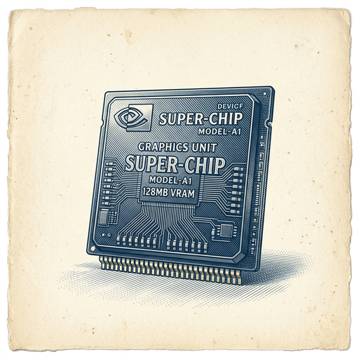
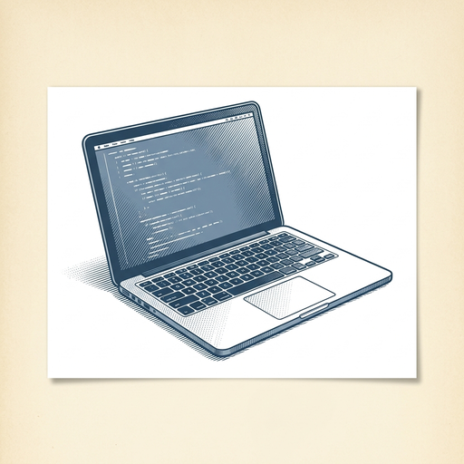

# ai espresso ☕ — Edition 72 · Variant C (Newspaper Comic · Snackable)

*your morning cup of AI*
**MON · AUG 24 · 2026**

---



**NEWS**

## Nvidia is spending $6 billion to build a US rival to DeepSeek

Nvidia signed a deal with startup Poolside to create an open AI ecosystem in the US that can compete with Chinese models like DeepSeek and American giants like OpenAI. The partnership aims to produce powerful AI models that run on Nvidia chips and aren't controlled by a handful of hyperscalers.

*Nvidia is hedging against a world where its biggest customers also become its competitors.*

[WSJ — Tech](https://www.wsj.com/tech/ai/nvidia-is-spending-6-billion-to-build-a-powerful-u-s-alternative-to-chinese-ai-c51c38cc?mod=rss_Technology) · Aug 24

---



**NEWS**

## Alibaba's Qwen model reverse-engineered real code in 30 minutes

A developer gave Qwen 3.8 27B—Alibaba's open-source model—an actual reverse-engineering task that normally takes hours of manual work. The model analyzed unfamiliar code, figured out what it did, and delivered working results in half an hour. It ran locally, no API calls required.

*Open-source models can now handle real engineering grunt work on your laptop.*

[Hacker News (front page)](https://www.xda-developers.com/qwen-3-8-27b-reverse-engineering-job-frontier-model/) · Aug 24

---


**NEWS**

## This AI agent can now replicate research papers better than Claude or ChatGPT

Inherent, a British AI lab founded by DeepMind alumni, released Faraday—an AI agent that reads scientific papers and reproduces the experiments. In benchmarks, it outperformed both Anthropic's and OpenAI's agents at replicating published research, which could accelerate how quickly new discoveries get validated and built upon.

*An AI that can independently reproduce experiments could speed up science verification and discovery*

[TechCrunch — AI](https://techcrunch.com/2026/08/22/inherent-founded-by-deepmind-alumni-says-its-ai-teammate-just-outperformed-anthropic-and-openai-at-replicating-research/) · Aug 24

---


**NEWS**

## DeepMind is building AI agents that play EVE Online and StarCraft II

Google DeepMind is partnering with game studios to test AI agents in live multiplayer games. The agents learn to play complex strategy games like EVE Online and StarCraft II alongside humans, building on 15 years of research that started with simple Atari games. Early prototypes are already running in real game environments.

*Gaming is where AI learns to handle messy, unpredictable environments with real stakes.*

[Google DeepMind Blog](https://deepmind.google/blog/from-atari-to-eve-online-building-on-15-years-of-ai-research-in-games/) · Aug 24

---


**NEWS**

## Anthropic eyes $100B IPO that could value it at $2 trillion

The Claude maker is preparing what would be one of the largest public offerings in tech history, with bankers pitching a valuation that would surpass SpaceX. The five-year-old company has told potential investors it plans to raise $100 billion when it goes public.

*If successful, it would make Anthropic more valuable than any AI company except possibly OpenAI or Google.*

[NYT — Technology](https://www.nytimes.com/2026/08/21/technology/anthropic-ipo-100-billion.html) · Aug 24

---


**NEWS**

## Xiaomi built its own phone chip to run AI on-device

The Chinese phone maker just launched its own mobile processor for flagship devices, breaking years of dependence on Qualcomm and MediaTek. The chip is designed to handle AI tasks locally on the phone instead of sending data to the cloud.

*Another major phone maker is betting its future on custom silicon for on-device AI.*

[Bloomberg Technology](https://www.bloomberg.com/news/articles/2026-08-24/xiaomi-develops-its-own-ai-mobile-chip-in-challenge-to-qualcomm) · Aug 24

---


---


**☕ Try this prompt**

### The energy audit

*When you're busy but can't remember the last time you felt momentum.*


```
List five things I did at work this week. For each one, tell me: did it give me energy or drain it? Then show me what pattern emerges and what one thing I should protect, delegate, or kill in the next two weeks.
```

---

*brewed by ai espresso · [spot something off?](mailto:jhimel@solvd.com?subject=AI%20Espresso%20issue%20report) · [repo](https://github.com/jackiehimel/AI-espresso-agent)*
