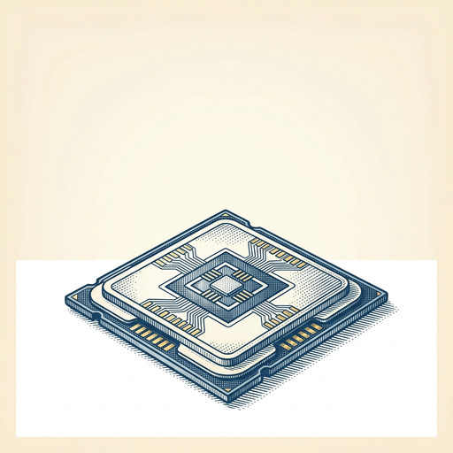

# ai espresso ☕ — Edition 79 · Variant C (Newspaper Comic · Snackable)

*your morning cup of AI*
**TUE · SEP 1 · 2026**

---



**NEWS**

## Anthropic signs $35 billion cloud deal with Nvidia backing

Nvidia is supplying chips to a Texas data center and holding the lease for Anthropic's cloud infrastructure. The deal shows Nvidia using its balance sheet to lock in a major AI customer while securing long-term chip demand for its hardware.

*Nvidia is now both supplier and landlord to the companies building frontier AI models.*

[WSJ — Tech](https://www.wsj.com/tech/ai/anthropic-signs-35-billion-cloud-deal-backed-by-nvidia-f12622f1?mod=rss_Technology) · Sep 1

---


**NEWS**

## The Pentagon just put ChatGPT and Grok on its central AI portal

OpenAI's ChatGPT and SpaceXAI's Grok are now available on the Pentagon's central portal for AI tools, joining Google's Gemini. Defense personnel can now access multiple commercial AI models through a single government gateway instead of using public versions.

*The military is treating AI chat tools like standard-issue software, not experimental tech.*

[TechCrunch — AI](https://techcrunch.com/2026/08/31/the-pentagon-now-has-its-own-version-of-chatgpt-and-grok/) · Sep 1

---


**NEWS**

## Waymo robotaxis are coming to Denver, San Diego, and Tampa

Alphabet's Waymo just announced it's launching driverless rides in three new cities. The expansion brings the robotaxi service beyond its current markets in San Francisco, Phoenix, Los Angeles, and Austin.

*Autonomous rides are becoming available to millions more Americans this year.*

[Mashable — AI](https://mashable.com/tech/waymo-san-diego-denver-tampa) · Sep 1

---


**NEWS**

## Perplexity now routes sensitive queries to your local AI model

Perplexity's new Hybrid Compute feature automatically detects when you're asking something private and runs it on your device instead of their cloud. You can manually toggle it too, and it works with any model you've got running locally through Ollama or LM Studio.

*You can finally use a powerful search AI without sending every personal question to the cloud.*

[Engadget — AI](https://www.engadget.com/2248548/perplexitys-hybrid-compute-splits-sensitive-tasks-between-cloud-and-local-ai/) · Sep 1

---


---


**☕ Try this prompt**

### The meeting escape hatch

*Before you auto-renew that weekly for another quarter.*


```
I have a recurring meeting that might not need to exist anymore. Describe the meeting below — who attends, what we cover, how long it runs. Tell me: the one async artifact that could replace it, the specific trigger that should召 召 召convene us live instead, and which person would secretly be relieved if it disappeared.
```

---

*brewed by ai espresso · [spot something off?](mailto:jhimel@solvd.com?subject=AI%20Espresso%20issue%20report) · [repo](https://github.com/jackiehimel/AI-espresso-agent)*
