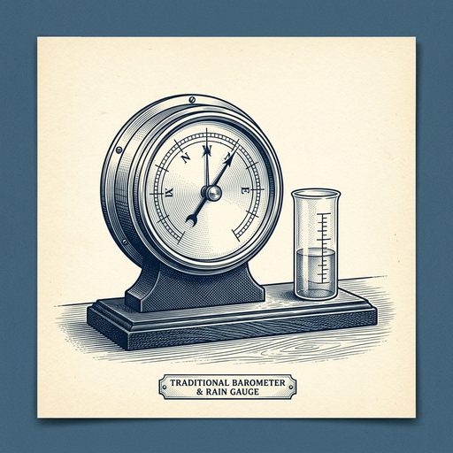
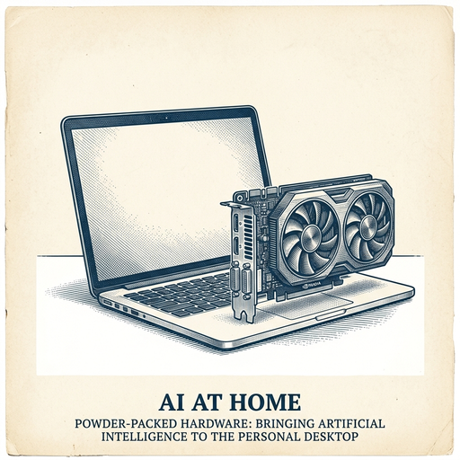

# ai espresso ☕ — Edition 81 · Variant C (Newspaper Comic · Snackable)

*your morning cup of AI*
**FRI · SEP 4 · 2026**

---


**NEWS**

## OpenAI ships GPT-6 Astra, its first model to hit internal security threshold

OpenAI's new GPT-6 Astra is out. The company calls it a generational leap for cybersecurity, software engineering, science, and computer use. It's the first model OpenAI says crosses its internal security capability threshold — though they're still releasing it.

*The model powerful enough to trigger OpenAI's own safety bar is now public.*

[The Verge — AI](https://www.theverge.com/ai-artificial-intelligence/989601/openai-gpt-6-astra-release) · Sep 4

---



**NEWS**

## Google's weather AI now beats traditional forecasts up to 15 days out

WeatherNext 3 outperforms existing physics-based weather models across most metrics, from hurricane tracking to precipitation forecasts. It runs faster than older AI models and already powers forecasts in Google Search, Maps, and Flights — plus it's available to researchers and meteorologists worldwide through an open API.

*AI weather models are now accurate enough to replace century-old physics simulations for most real-world decisions.*

[Google DeepMind Blog](https://deepmind.google/blog/introducing-weathernext-3-our-most-advanced-and-accurate-global-weather-ai-model/) · Sep 4

---


**NEWS**

## Google now lets you talk to Gmail, Docs, and Keep like Gemini Live

Google is rolling out voice modes for Gmail, Docs, and Keep that work like Gemini Live — you can manage emails, documents, and notes by talking to them in real time. The conversational AI responds as you speak, letting you dictate, search, and organize without typing.

*Voice control moves from chatbot novelty to everyday productivity tools millions already use.*

[The Verge — AI](https://www.theverge.com/tech/989508/google-gmail-docs-keep-live-voice-modes-gemini) · Sep 4

---



**NEWS**

## NVIDIA and Microsoft are shipping AI agents that run on your laptop

Starting in October, new RTX Spark Windows PCs will run AI agents locally—no cloud required. NVIDIA and Microsoft built tools to make agents easier to set up and faster to run on RTX GPUs, bringing what used to need server farms down to a desktop machine.

*AI agents are moving from the cloud to hardware you can own and control.*

[NVIDIA Blog](https://blogs.nvidia.com/blog/local-ai-ifa-next-gen-agents-nv-pair-rtx-spark/) · Sep 4

---


---


**☕ Try this prompt**

### The energy audit

*When your calendar is full but nothing feels like it's moving forward.*


```
Look at my calendar for the next two weeks and the commitments I'll list below. Tell me which three things are costing me the most energy relative to their actual impact. Then write one sentence I can use to gracefully drop, delegate, or shrink each one.
```

---

*brewed by ai espresso · [spot something off?](mailto:jhimel@solvd.com?subject=AI%20Espresso%20issue%20report) · [repo](https://github.com/jackiehimel/AI-espresso-agent)*
