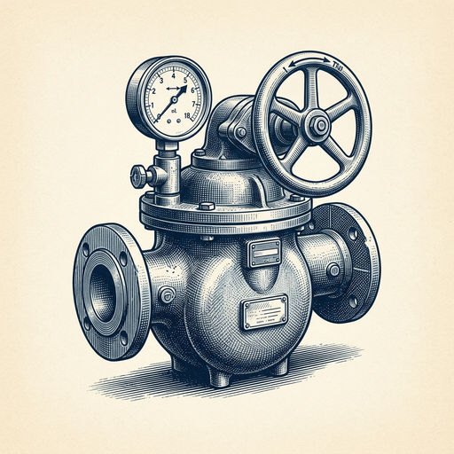

# ai espresso ☕ — Edition 86 · Variant C (Newspaper Comic · Snackable)

*your morning cup of AI*
**THU · SEP 10 · 2026**

---


**NEWS**

## Apple just launched a $2,000 foldable iPhone

The iPhone Duo marks Apple's first foldable phone, priced at $1,999. Announced at the company's September event alongside AI features and other devices, it enters a market Samsung and others have occupied for years.

*Apple's finally playing catch-up in foldables — at flagship pricing*

[NYT — Technology](https://www.nytimes.com/2026/09/09/technology/apple-iphone-duo-foldable-phone.html) · Sep 10

---


**NEWS**

## AWS is giving 132 universities free access to its AI coding assistant

Students at 132 schools across 18 countries get a full year of Kiro free — Amazon's AI pair programmer that writes, debugs, and explains code inside VS Code and JetBrains. AWS wants graduates who've already logged hours with an agent before their first job.

*Free tier wars are moving upstream to capture students before they pick a default tool.*

[Amazon News (About Amazon)](https://www.aboutamazon.com/news/aws/amazon-expands-free-kiro-access-students-universities?utm_source=rss) · Sep 10

---



**NEWS**

## Google's AI can now pinpoint methane leaks from orbit

Google and NASA's Jet Propulsion Lab built a deep learning model that processes satellite imagery from EMIT to detect and measure methane emissions anywhere on Earth. The tool can spot leaks from oil wells, landfills, and agriculture that ground sensors miss—turning orbital data into a global emissions map.

*Methane traps 80x more heat than CO2 short-term, and most leaks go undetected without satellites.*

[Google — Innovation & AI](https://blog.google/innovation-and-ai/models-and-research/google-research/mapping-global-methane-emissions-from-space/) · Sep 10

---


**NEWS**

## DeepSeek just made AI 100x cheaper with new model priced at pennies

DeepSeek released a new AI model charging a fraction of a cent per million tokens—far below what OpenAI, Anthropic, and other rivals charge. The pricing puts pressure on competitors who've been racing to cut costs while maintaining performance.

*AI inference just became cheap enough to run at scale in consumer apps without burning cash*

[Bloomberg Technology](https://www.bloomberg.com/news/articles/2026-09-10/deepseek-s-new-low-cost-model-deals-a-fresh-blow-to-openai-z-ai) · Sep 10

---


---


**☕ Try this prompt**

### The hiring red-flag translator

*Before you convince yourself that gut feeling doesn't matter.*


```
I'm reviewing a candidate who looks good on paper but something feels off. I'll describe what I noticed in the interview and their background. Tell me: if this person joins, what will break first, what will I be coaching them on in month three, and the one question I should have asked but didn't.
```

---

*brewed by ai espresso · [spot something off?](mailto:jhimel@solvd.com?subject=AI%20Espresso%20issue%20report) · [repo](https://github.com/jackiehimel/AI-espresso-agent)*
