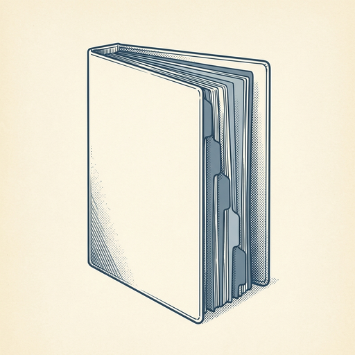
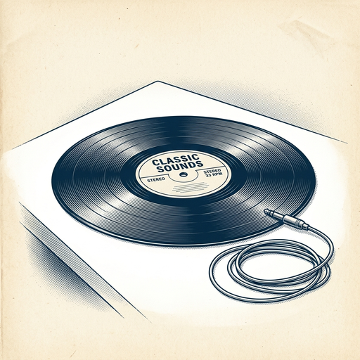
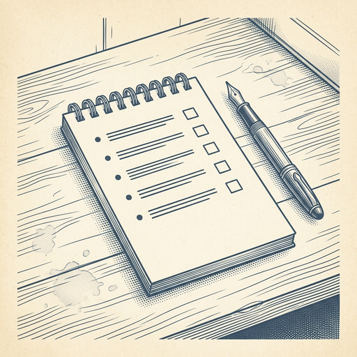

# ai espresso ☕ — Edition 87 · Variant C (Newspaper Comic · Snackable)

*your morning cup of AI*
**FRI · SEP 11 · 2026**

---


**NEWS**

## OpenAI stopped selling Pro subscriptions because too many people want Astra

OpenAI paused new Pro sign-ups after demand for its Astra model overwhelmed its systems. Pro subscribers hit compute hardest, so the company is adding capacity before reopening the tier. If you're already a Pro user, you keep access.

*When a company can't keep up with AI demand, it picks existing customers over new revenue.*

[TechCrunch — AI](https://techcrunch.com/2026/09/10/openai-puts-pro-subscriptions-on-hold-due-to-astra-demand/) · Sep 11

---



**NEWS**

## Cursor just shipped an AI project manager that runs thousands of subagents

Cursor's new Projects feature lets you spin up thousands of AI subagents to tackle large codebases over weeks or months. Instead of losing context between sessions, you can now delegate entire tasks and have agents maintain state across a long-running project.

*AI coding tools are moving from autocomplete to autonomous project management*

[Cursor Changelog (official)](https://cursor.com/changelog/projects) · Sep 11

---



**NEWS**

## Universal Music will let you remix its catalog with ElevenLabs AI

Universal Music Group is building a platform with ElevenLabs that lets users create remixes, mashups, and new versions of licensed tracks from its catalog. The multiyear deal marks a major label embracing AI-generated music instead of fighting it.

*A top-three record label just decided licensing AI remixes beats blocking them.*

[The Verge — AI](https://www.theverge.com/ai-artificial-intelligence/993465/universal-music-elevenlabs-ai) · Sep 11

---


**NEWS**

## Slack can now build charts and dashboards for you inside any chat

Slackforce Surfaces lets you ask Slackbot to generate interactive reports, polls, or dashboards by pulling data from conversations and connected apps like Google Drive or Salesforce. You describe what you need in plain language, and AI assembles it without leaving the thread.

*Turns Slack from a chat app into a no-code workspace where data lives where discussions happen.*

[The Verge — AI](https://www.theverge.com/tech/989853/slackforce-surfaces-launch) · Sep 11

---


---



**☕ Try this prompt**

### The meeting cost calculator

*Before you send that calendar invite with eight people on it.*


```
I'm about to schedule a recurring meeting. Tell me: if we converted every hour of this meeting into salary cost across all attendees, what's the annual burn? Then give me three async alternatives that would accomplish 80% of the value, and the one signal that means we actually need to meet live.
```

---

*brewed by ai espresso · [spot something off?](mailto:jhimel@solvd.com?subject=AI%20Espresso%20issue%20report) · [repo](https://github.com/jackiehimel/AI-espresso-agent)*
