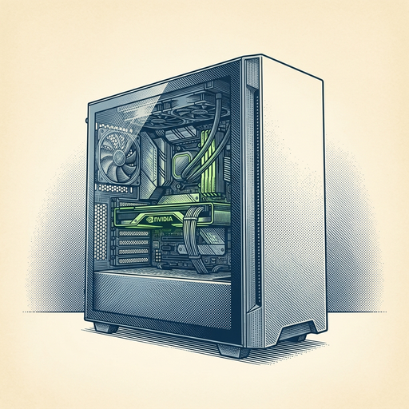

# ai espresso ☕ — Edition 89 · Variant C (Newspaper Comic · Snackable)

*your morning cup of AI*
**MON · SEP 14 · 2026**

---


**NEWS**

## Anthropic CEO says it's time to slow down AI development

Dario Amodei is calling to 'pace the frontier' — his term for pumping the brakes on new AI models. Anthropic will now give third-party evaluators like METR early access to its models before release to verify safety practices. The move marks a shift from the race-to-ship mentality that's defined the past two years.

*The CEO of a leading AI lab is publicly advocating for slower progress.*

[The Verge — AI](https://www.theverge.com/ai-artificial-intelligence/994337/anthropic-ceo-slow-down-ai-development) · Sep 14

---


**NEWS**

## Microsoft publishes 37-page AI code saying people come first

Microsoft released a detailed code of conduct for AI development emphasizing human priorities, joining a growing conversation about slowing down. The move follows Anthropic CEO Dario Amodei's weekend call for coordinated deceleration and recent researcher warnings that AI progress may be outpacing our ability to safely deploy and verify complex systems.

*Major labs are publicly acknowledging safety concerns while still shipping faster than ever.*

[The Verge — AI](https://www.theverge.com/news/994566/microsoft-humanist-ai-code-of-conduct) · Sep 14

---



**NEWS**

## Perplexity's AI agent now runs locally on Windows PCs

Portable Computer is a downloadable version of Perplexity's agent that plans and executes multistep tasks entirely on your machine, accelerated by NVIDIA RTX GPUs. It uses local models to analyze data and complete workflows without sending information to the cloud.

*Sensitive work can now stay on-device while an agent handles complex tasks for you.*

[NVIDIA Blog](https://blogs.nvidia.com/blog/local-ai-perplexity-windows-pcs/) · Sep 14

---


**NEWS**

## iOS 27 code suggests Apple may let you swap Siri for ChatGPT or Claude

A developer digging through iOS 27 beta code found references indicating Apple might let users choose a different AI assistant as their default—like ChatGPT or Claude—instead of Siri. It's still unclear whether this will be a full system replacement or limited to certain features, but the code hints at genuine choice coming to iPhone.

*iPhone users could finally pick the AI assistant they actually want to use.*

[9to5Mac — AI](https://9to5mac.com/2026/09/14/ios-27-code-shows-you-may-be-able-to-replace-siri-ai-with-claude-or-chatgpt-poll/) · Sep 14

---


---


**☕ Try this prompt**

### The decision regret vaccine

*Separates real regret signals from the brain's endless what-if loop.*


```
I made a decision recently that I keep second-guessing. I'll describe what I chose and what I passed up. Don't tell me if I was right or wrong. Instead, tell me what information would actually change my mind if I learned it tomorrow, versus what's just noise I should ignore.
```

---

*brewed by ai espresso · [spot something off?](mailto:jhimel@solvd.com?subject=AI%20Espresso%20issue%20report) · [repo](https://github.com/jackiehimel/AI-espresso-agent)*
