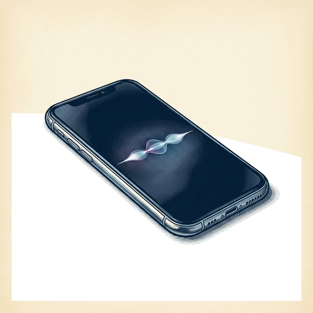
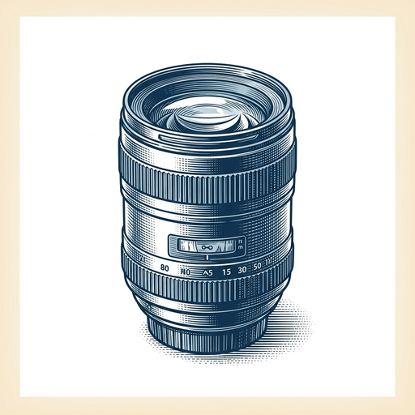
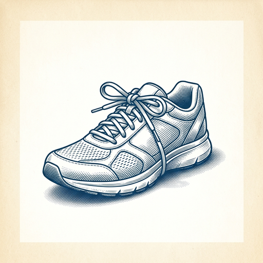

# ai espresso ☕ — Edition 90 · Variant C (Newspaper Comic · Snackable)

*your morning cup of AI*
**TUE · SEP 15 · 2026**

---



**NEWS**

## Apple ships Siri AI, its biggest assistant overhaul in a decade

Apple released Siri AI, a ground-up redesign that can handle multi-step requests, understand context across apps, and learn your preferences without sending data to the cloud. It arrives in iOS 20 this fall and works on iPhone 15 and newer.

*Apple just made Siri actually useful — and kept all your data on-device.*

[Apple Newsroom](https://www.apple.com/newsroom/2026/09/siri-ai-a-profoundly-more-capable-and-personal-assistant-is-here/) · Sep 15

---


**NEWS**

## Salesforce built a reasoning model that does sales calls and support tickets

Salesforce Koa runs on Nvidia's open-weight Nemotron and is trained specifically for sales, marketing, and customer support tasks. It's a domain-specific reasoning model you can deploy for CRM work instead of using a general-purpose lab model.

*Shows how companies can tune open models for vertical work rather than pay OpenAI or Anthropic per seat*

[TechCrunch — AI](https://techcrunch.com/2026/09/15/salesforce-and-nvidias-new-reasoning-model-is-everything-the-ai-labs-should-fear/) · Sep 15

---



**NEWS**

## OpenAI bought a smartphone camera company for $300 million

OpenAI acquired Glass Imaging, a startup founded by ex-Apple engineers who built Portrait Mode. The deal signals OpenAI's push into hardware and suggests future phones could get native AI vision features baked into the camera itself.

*OpenAI is moving from software into the physical layer where photos get captured.*

[TechCrunch — AI](https://techcrunch.com/2026/09/14/openai-buys-smartphone-camera-maker-glass-imaging-for-300-million-report-says/) · Sep 15

---



**NEWS**

## OpenAI, Anthropic, Google, and Musk agree to slow AI development

Sam Altman, Dario Amodei, Demis Hassabis, and Elon Musk loosely agreed over the weekend to 'pace the frontier' of AI development. Critics immediately questioned whether this is a genuine safety measure or a way for the leading labs to protect their lead while smaller competitors catch up.

*If the biggest labs slow down, it could either make AI safer or just lock in their advantage.*

[The Verge — AI](https://www.theverge.com/ai-artificial-intelligence/995186/is-big-techs-ai-slowdown-a-safety-pact-or-a-cartel) · Sep 15

---


---


**☕ Try this prompt**

### The learning gap spotter

*When effort isn't translating to progress and you need a diagnostic.*


```
I'm trying to get better at something I'll describe below. I've been working on it for a while but progress feels slow. Tell me: the one skill I'm probably neglecting that would unlock faster improvement, the mistake I'm likely repeating without noticing, and one unconventional resource I should try next.
```

---

*brewed by ai espresso · [spot something off?](mailto:jhimel@solvd.com?subject=AI%20Espresso%20issue%20report) · [repo](https://github.com/jackiehimel/AI-espresso-agent)*
