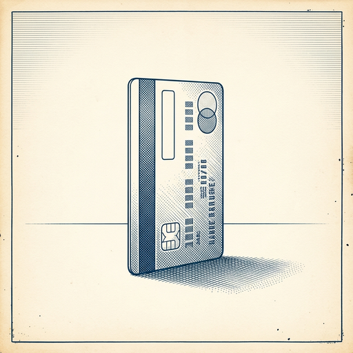

# ai espresso ☕ — Edition 92 · Variant C (Newspaper Comic · Snackable)

*your morning cup of AI*
**THU · SEP 17 · 2026**

---


**NEWS**

## Claude can now make docs and slides for you in chat

Anthropic added Docs and Slides to Claude today. You can ask Claude to create documents or presentations directly in chat, then export, edit, and share them. The company is also merging its regular chat and Cowork modes into a single interface with all features available in one place.

*Claude now competes directly with Google's workspace integrations, not just as a chatbot.*

[The Verge — AI](https://www.theverge.com/ai-artificial-intelligence/996234/anthropic-one-claude-cowork-docs-slides) · Sep 17

---


**NEWS**

## Google just opened your smart home to any AI agent

Google Home now supports the Model Context Protocol, meaning AI tools like Claude can directly control your lights, thermostats, and cameras. Any agent that speaks MCP can read your home's data and flip switches without you building custom integrations.

*Your smart home just became programmable by any AI that can talk to it.*

[The Verge — AI](https://www.theverge.com/tech/996310/google-home-mcp-integration-agentic-ai-smart-home-price-release-date) · Sep 17

---



**NEWS**

## Mastercard and Visa are building checkout systems for AI shopping agents

Mastercard and Visa are both rolling out infrastructure that lets AI bots complete purchases on your behalf using your card. American Express is also preparing its system for agent-based shopping. The card networks are building the rails before anyone knows how many people will actually want bots to buy things for them.

*Payment infrastructure is betting on AI agents before consumers have asked for them.*

[WSJ — Tech](https://www.wsj.com/tech/ai/mastercard-inks-deal-as-payment-giants-brace-for-new-era-of-ai-shopping-eb22da8b?mod=rss_Technology) · Sep 17

---


**NEWS**

## AI agents can now call restaurants and customer service for you

Meta's Muse and a rival called Instinct both just added phone-calling features. You can ask them to book a table, cancel a subscription, or handle other calls you'd rather not make yourself — the agent dials, navigates menus, and talks to humans on your behalf.

*AI assistants are moving from answering questions to acting as your actual representative on the phone.*

[TechCrunch — AI](https://techcrunch.com/2026/09/17/rival-ai-agents-instinct-and-metas-muse-both-add-the-ability-to-make-calls/) · Sep 17

---


---


**☕ Try this prompt**

### The priority collision detector

*When everything feels urgent but you can only do one thing well.*


```
I have three things competing for my time this week. I'll list them below. For each one, tell me: what happens if it slips by a week, what happens if it slips by a month, and which of the other two it's secretly stealing energy from. Then rank them.
```

---

*brewed by ai espresso · [spot something off?](mailto:jhimel@solvd.com?subject=AI%20Espresso%20issue%20report) · [repo](https://github.com/jackiehimel/AI-espresso-agent)*
