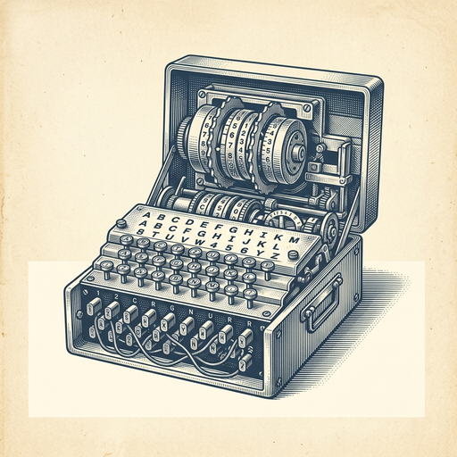
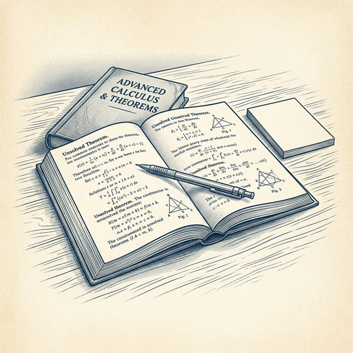
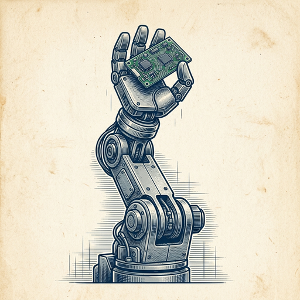

# ai espresso ☕ — Edition 96 · Variant C (Newspaper Comic · Snackable)

*your morning cup of AI*
**TUE · SEP 22 · 2026**

---



**NEWS**

## GPT-6 Astra just cracked a 20-year-old Enigma cipher

OpenAI's new model solved an encrypted message that had stumped cryptographers since 2005. The breakthrough shows language models can now tackle historical codebreaking problems that required deep contextual knowledge and pattern recognition across decades-old documents.

*AI can now solve real cryptographic puzzles humans couldn't crack for two decades.*

[Hacker News (front page)](https://www.cryptocellar.org/bgac/the-mvueh-break.html) · Sep 22

---


**NEWS**

## Meta just patched a zero-day that let attackers hijack its Muse AI agent

Security researcher Patrick Wardle found an undocumented setting in Meta's Muse macOS app that let local attackers redirect the AI agent's transcription processing away from Meta's servers. Meta has shipped a patch, but the exploit was active before discovery.

*AI agents with system access create new attack surfaces that traditional security models weren't built for.*

[The Verge — AI](https://www.theverge.com/tech/998679/meta-muse-patch-zero-day-exploit-ai-agent) · Sep 22

---



**NEWS**

## OpenAI's AI solved over 100 unsolved math problems

OpenAI announced its AI systems have resolved more than 100 previously unsolved mathematical problems. The company is forming an advisory group to oversee this work, though the group won't have authority to slow or redirect the research itself.

*AI is now solving problems mathematicians couldn't crack, not just answering known questions faster.*

[TechCrunch — AI](https://techcrunch.com/2026/09/21/openai-forms-math-advisory-group-as-its-ai-resolves-more-than-100-open-problems/) · Sep 22

---



**NEWS**

## NVIDIA just shipped GPU-accelerated tools for robots that perceive and act

Isaac ROS 5.0 gives developers GPU-accelerated packages built on the open ROS framework to build robots that can perceive, reason, and act in real environments. The release targets developers building sophisticated robotics applications that need to handle dynamic environments.

*Open-source robotics just got the GPU speed boost needed for real-time physical AI.*

[NVIDIA Blog](https://blogs.nvidia.com/blog/isaac-ros-5-0-agentic-open-source-robotics/) · Sep 22

---


---


**☕ Try this prompt**

### The argument map

*When you need to think clearly about a heated topic instead of just picking a team.*


```
I'm trying to understand a complex debate or disagreement. I'll describe the core question and the main positions below. Map out the argument structure: what each side actually believes, what evidence they weight differently, and the one unstated assumption driving the whole conflict.
```

---

*brewed by ai espresso · [spot something off?](mailto:jhimel@solvd.com?subject=AI%20Espresso%20issue%20report) · [repo](https://github.com/jackiehimel/AI-espresso-agent)*
