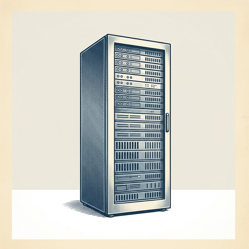
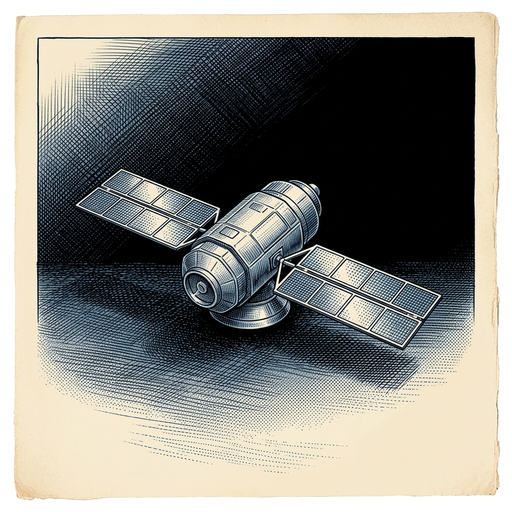

# ai espresso ☕ — Edition 99 · Variant C (Newspaper Comic · Snackable)

*your morning cup of AI*
**FRI · SEP 25 · 2026**

---



**NEWS**

## Anthropic just locked in $12 billion of computing power from Akamai

Anthropic signed a seven-year, $11.6 billion deal with Akamai for AI computing capacity—on top of the $1.8 billion contract the two companies signed earlier this year. That's $13.4 billion total committed to one infrastructure provider, giving Anthropic guaranteed access to the chips and clusters it needs to train future Claude models.

*Shows how expensive the race to build frontier AI has become—and how much cash Anthropic is betting on scale.*

[Bloomberg Technology](https://www.bloomberg.com/news/videos/2026-09-25/anthropic-akamai-strike-12-billion-ai-computing-deal-video) · Sep 25

---



**NEWS**

## Google is training an AI to fly satellites in space

Project Suncatcher is Google's effort to put AI models on satellites that can make decisions in orbit without waiting for ground control. The system would let satellites navigate around debris, adjust paths, and respond to events in real time — crucial as low Earth orbit gets more crowded.

*Autonomous satellites could dodge collisions and adapt faster than human operators can command them.*

[Google — Innovation & AI](https://blog.google/innovation-and-ai/models-and-research/google-research/google-project-suncatcher-facts/) · Sep 25

---


**NEWS**

## Microsoft bundles chat, coding, and agents into one Copilot app

Microsoft just launched a redesigned Copilot that combines three AI tools in one interface: chat, coding assistance, and agents that can act on your behalf. The company is also renaming Scout, its AI personal assistant from Build, to Autopilot.

*Microsoft is betting a single AI interface can replace multiple separate tools.*

[The Verge — AI](https://www.theverge.com/news/1000532/microsoft-copilot-super-app-chat-coding-autopilot) · Sep 25

---


**NEWS**

## Amazon sellers can now run an AI assistant that works 24/7

Amazon upgraded its Seller Assistant to handle routine tasks around the clock and launched a plugin that pipes seller data into Claude and Amazon Q. Sellers can ask these AI tools questions about their store performance, inventory, or listings without opening Seller Central.

*Third-party sellers get AI that actually touches their business data and acts on it.*

[Amazon News (About Amazon)](https://www.aboutamazon.com/news/innovation-at-amazon/seller-assistant-plugin-amazon-quick-claude?utm_source=rss) · Sep 25

---


**NEWS**

## Meta just launched an AI app that builds VR games from text prompts

Meta released Horizon Create for mobile and Horizon Studio for desktop—both let you generate games for its Horizon social platform using AI prompts. The mobile version is designed for quick creation on the go, while the browser app gives more detailed control over what gets built.

*Game creation moved from code editors to chat windows you can use on your phone.*

[The Verge — AI](https://www.theverge.com/games/999972/meta-horizon-create-studio-ai-games) · Sep 25

---


**NEWS**

## Google's AI can now remember your stuff without anyone at Google seeing it

DeepMind just added encrypted server-side memory to Private AI Compute, letting personal AI assistants remember context across sessions while keeping that data cryptographically inaccessible to Google itself. The memory lives on servers but stays locked even from employees and subpoenas.

*Personal AI that remembers you just became possible without trading away your privacy.*

[Google DeepMind Blog](https://deepmind.google/blog/advancing-private-ai-compute-with-secure-server-side-memory/) · Sep 25

---


---


**☕ Try this prompt**

### The upside-down org chart

*When everyone's busy but nobody's getting sharper.*


```
I'll describe my team structure and current responsibilities below. Redesign it as if you were optimizing for learning speed instead of shipping speed. Show me what changes, who should report to whom, and which meetings disappear. Assume the same headcount.
```

---

*brewed by ai espresso · [spot something off?](mailto:jhimel@solvd.com?subject=AI%20Espresso%20issue%20report) · [repo](https://github.com/jackiehimel/AI-espresso-agent)*
